# (PART) R 语言可视化 {.unnumbered}

# 使用基础包绘图 {#causal}


 
## 绘制基本图形

### 绘制分布关系

数据的数字特征刻画了数据的主要特征，而对数据总体情况做全面描述时，研究人员需要研究数据的分布情况。

**主要方法**：绘制相应的图形，如直方图，条形图、饼图、箱线图等。

#### 直方图

**概念介绍**：直方图（Histogram）由一系列高度不等的纵向条纹或者线段表示数据分布的情况。

**注意**：一般用横轴表示数据所属类别，纵轴表示数量或者占比。

**适用**：连续数据。

**例子**：我们使用模拟数据进行讲解，通过正态分布产生30个数据。

```r
#数据模拟产生
x <- rnorm(30, mean=10, sd=1)
print(round(x,2))
```

```
##  [1]  8.39 10.98 10.41  9.40  9.56 10.44 10.27  9.35 10.42  9.23  8.67 11.05
## [13]  8.44  7.91 11.13  8.71  9.65 10.23  9.75  9.14  8.04 11.00  8.80 10.67
## [25] 10.00  8.79  9.93  9.39  9.93 11.60
```

`hist()`中的`breaks()`可以分段区间，取值可以是一个向量（各区间端点）或者一个数字（拆分为多少段），或者一个字符串（计算划分区间的算法名称），或者一个函数（划分区间个数的方法）。这里给出例子


```r
hist(x,breaks = 3)
```

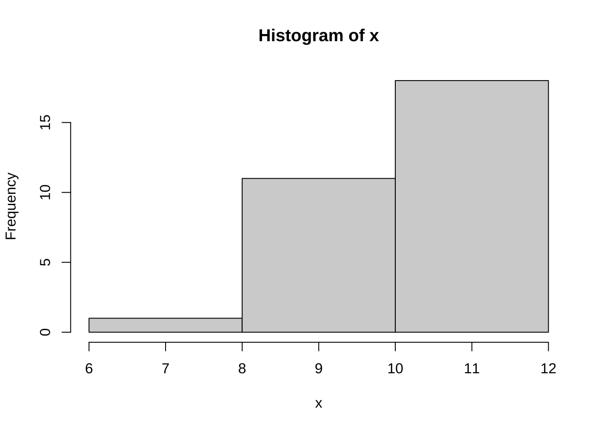

```r
hist(x, col=rainbow(15),breaks = 3,
     main='正态随机数', xlab='', ylab='频数')
```

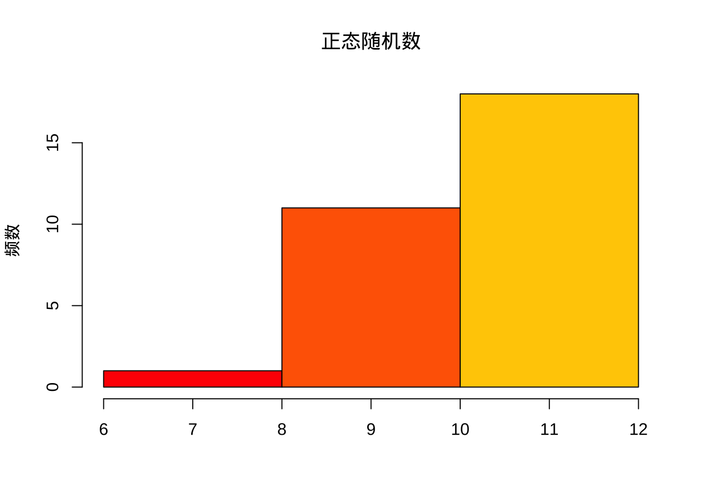

`breaks = 3`表示x轴分为3个节点。其他设置可参考帮助文档，即`?hist`。这里加入其他参数`col，main，xlab，ylab`，分别表示颜色，主题名称，x轴名称，y轴名称设置。细节将会在下面一章进行详细解释。


函数`density()`估计核密度。`freq=FALSE`绘制频率图。下面的程序作直方图，并使用`lines()`函数添加核密度曲线：

```r
tmp.dens <- density(x)
hist(x, freq=FALSE,
     ylim=c(0,max(tmp.dens$y)+0.1),
     col=rainbow(15),
     main='正态随机数',
     xlab='', ylab='频率')
lines(tmp.dens, lwd=2, col='blue')
```

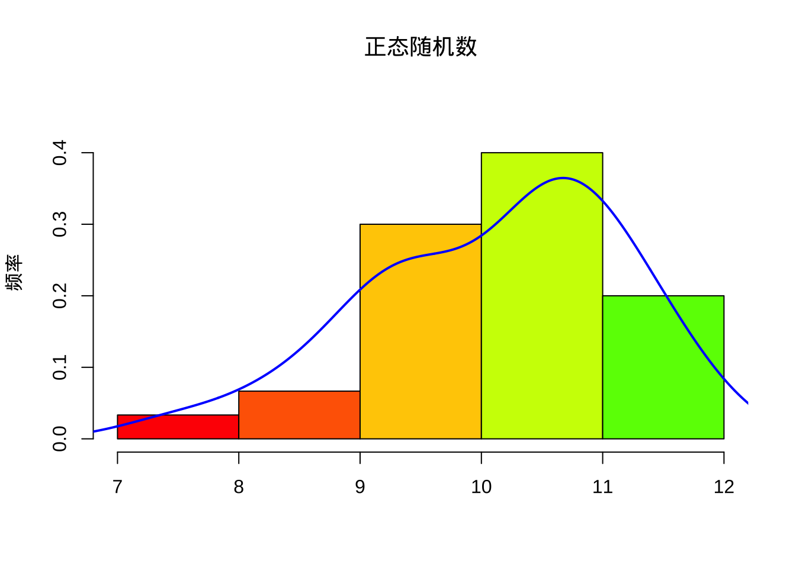

#### 条形图

**概念介绍**：数量的多少画成长短不同的直条，然后把这些直条按一定的顺序排列起来。

**注意**：条形图的x轴是数据类别（**离散型**），y轴是相应类别的频数。


```r
# 复现课件中的条形图
gender = table(c(rep("F",12),rep("M",20)))
barplot(gender,col = c("red","green"),main = "性别分布",horiz = T)
```


**数据介绍**：`VADeaths`数据集记录的是1940年Viginia(弗吉尼亚洲)不同人群（`Rural Male、Rural Female 、Urban Male、Urban Female`）中每一千人的死亡情况。

**例子**：数据前6行展示如下：


|      | Rural Male| Rural Female| Urban Male| Urban Female|
|:-----|----------:|------------:|----------:|------------:|
|50-54 |       11.7|          8.7|       15.4|          8.4|
|55-59 |       18.1|         11.7|       24.3|         13.6|
|60-64 |       26.9|         20.3|       37.0|         19.3|
|65-69 |       41.0|         30.9|       54.6|         35.1|
|70-74 |       66.0|         54.3|       71.1|         50.0|

这里绘制该数据的条形图。`beside`默认值为FALSE，每一列都将给出堆砌的“子条”高度，若 `beside=TRUE`，则每一列都表示一个分组并列


```r
barplot(VADeaths)  
```


```r
barplot(VADeaths, beside = TRUE)
```


**结论：**随着年龄的增长，`Viginia`人群的死亡率逐渐增加，并且在4类人群中， `Urban Male`的死亡率比同年龄段的其他群体的死亡率高。同时，在同一环境下，相同年龄段的男性的死亡率要比女性高。

#### 饼图

**概念介绍**：将各项的大小与各项总和的比例。反映部分与部分、部分与整体之间的比例关系。

**例子**：

```r
percent <- colSums(VADeaths)*100/sum(VADeaths)
pie(percent,labels=paste0(colnames(VADeaths),'\n',round(percent,2),'%'))
```

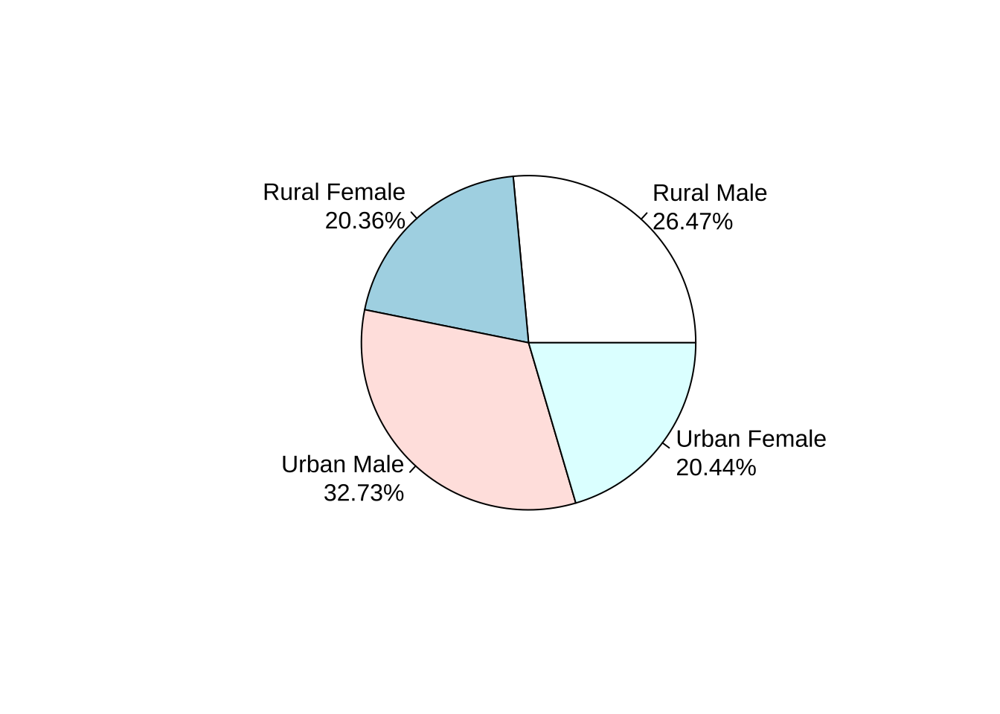

```r
pie(percent,radius=0.8) #init.angle
```

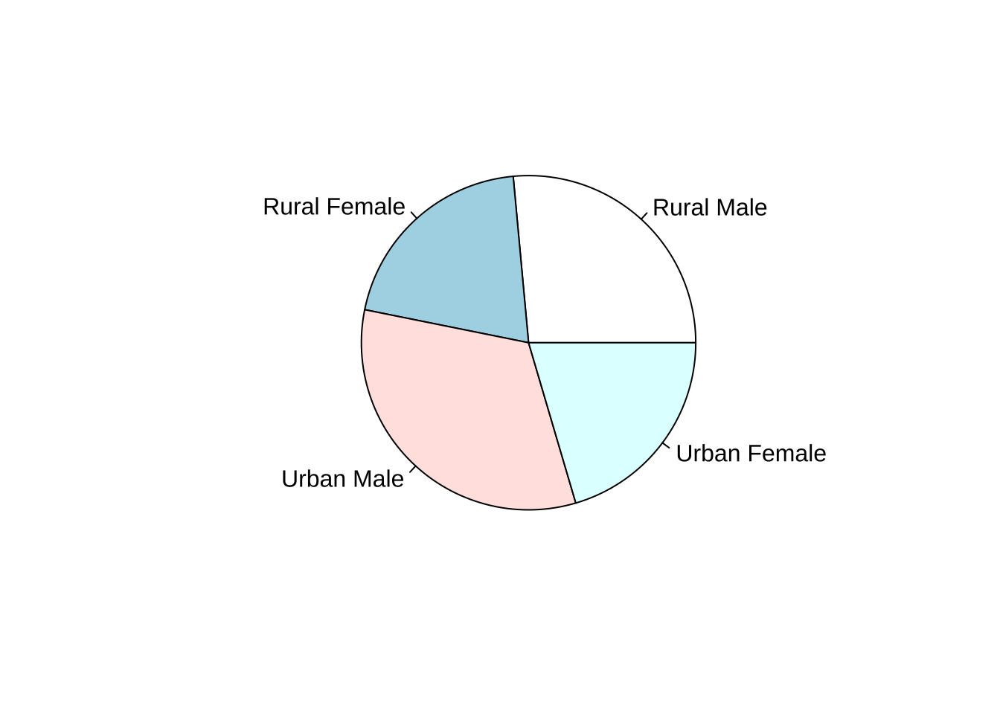

```r
# ?pie
```

**结论：**Virginia人群中死亡最高的是Urban Male，而且男性的死亡率比女性死亡率要高。


#### 箱线图

**概念介绍**：绘制须使用常用的统计量（最小值、下四分位数、中位数、上四分位数和最大值），并提供有关数据位置和分散情况的关键信息，尤其在比较不同特征时，更可表现其分散程度差异。

**数据介绍**：iris数据集（鸢尾花数据集），是常用的分类实验数据集合，由Fisher在1936年收集整理。数据集包含了150个子数据集，分为3类（分别为setosa、versicolor、virginica），每类50个数据，每个数据包含4个属性，即花萼长度Sepal.Length	、花萼宽度Sepal.Width、花瓣长度Petal.Length、花瓣宽度Petal.Width。

前6行数据如下：


| Sepal.Length| Sepal.Width| Petal.Length| Petal.Width|Species |
|------------:|-----------:|------------:|-----------:|:-------|
|          5.1|         3.5|          1.4|         0.2|setosa  |
|          4.9|         3.0|          1.4|         0.2|setosa  |
|          4.7|         3.2|          1.3|         0.2|setosa  |
|          4.6|         3.1|          1.5|         0.2|setosa  |
|          5.0|         3.6|          1.4|         0.2|setosa  |
|          5.4|         3.9|          1.7|         0.4|setosa  |

**例子**：
使用箱线图进行分析，使用两种方法：单独分析四个变量内部的数据分布情况；组间比较（Sepal.Length ~ Species）注意这里的x应该是因子型。这里没有对其他参数进行添加，大家根据自己需求添加即可。

```r
attach(iris)
boxplot(iris[1:4], main = '单独的箱线图')
```

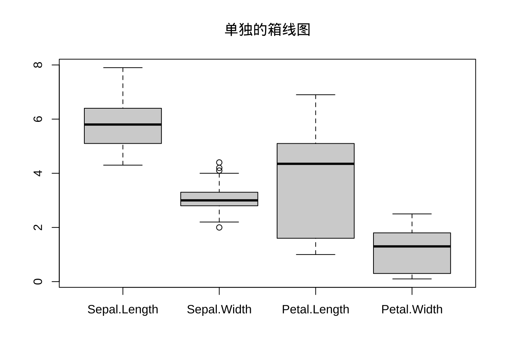

```r
boxplot(Sepal.Length ~ Species, data = iris, main = '组间比较的箱线图')
```


**结论：**第一个图：Sepal.Width列含有四个异常值。

第二个图：Sepal.Length列中，类别属于virginica的数据含有一个异常值。同时，从第一个图可以看到，Petal.Length列前半部分相对分散，而后半部分相对密集。


### 绘制数据间关系

**概念介绍**：在分析数据间关系时，常用散点图和多变量相关矩阵图查看数据间的相关关系。

#### 散点图

**特点：**

(1) 特征之间是否存在关联趋势，关联趋势是线性的还是非线性的。

(2) 一目了然的看出离群值。从而可以进一步分析这些离群值是否可能在建模分析中产生很大的影响。

**例子**：使用cars数据进行分析速度（speed）和刹车距离（dist）之间的关系

```r
plot(cars[, 1], cars[, 2],xlab = "speed",ylab = "dist")
```


```r
# plot(cars)  # 效果同上
```

**结论：**随着汽车行驶速度的增加，刹车距离也在不断增加。


#### 散点矩阵图

**概念介绍**：散点矩阵图将多个散点图组合起来，以便可以同时浏览多个二元变量关系，一定程度上克服了在平面上展示高维数据分布情况的困难。可以使用`plot()`或者`pairs()`进行绘制。

**适用**：高维数据

- **plot**


```r
plot(iris[,1:4]) 
```


**结论：**花瓣长度（Petal.length）与花瓣宽度（Petal.Width）有明显的线性关系，其余属性之间的关系不是很明显。


- **pairs**

此外，R中还提供了另一个绘制散点矩阵图的函数——pairs函数，绘图对象有**数据框**和**公式**两种：


```r
pairs(iris[,1:4])
pairs(~Sepal.Length + Sepal.Width + Petal.Length + Petal.Width, data = iris)  # 效果同上
```


#### 多变量相关矩阵图

**概念介绍**：多变量相关矩阵图是**相关系数矩阵**（correlation matrix）的可视化结果，显示了两两变量间的相关关系，对数据维度相对较大的数据有较好的展示效果。在R的`corrgram`包中的`corrgram`函数可绘制多变量相关矩阵图。

**数据介绍**：Mtcar数据集是1974年Motor Trend US杂志公布的32辆车的11个数据，包括燃料消耗和10个关于汽车设计与性能的数据。

**例子**：下面、根据这个数据集，绘制适用中不同元素描述相关性大小的图。


```r
library(corrgram) 
corrgram(mtcars)
```


```r
corrgram(mtcars, order=TRUE, upper.panel=panel.ellipse, 
         main="Correlogram of mtcars intercorrelations") 
```


```r
# 相关图，主对角线上方绘制置信椭圆和平滑拟合曲线，主对角线下方绘制阴影
```

**结论**：`disp`与`cyl`呈正相关关系，且相关程度较高。此外，`mpg`与`wt`呈高度负相关，且`am`与`carb`基本没有关系。

这里可以对`upper.panel`和`lower.panel`进行设置，展示不同图形。具体可以通过帮助获得相信参数设置信息（`?corrgram`）


```r
# 相关图，主对角线上方绘制散点图，主对角线下方绘制饼图
corrgram(mtcars, order=TRUE, upper.panel=panel.pts, lower.panel=panel.pie, 
         main="Correlogram of mtcars intercorrelations") 
```


```r
# 相关图，主对角线上方绘制置信区间，主对角线下方绘制相关系数
corrgram(mtcars, order=TRUE, upper.panel=panel.conf, lower.panel=panel.cor,
         main="Correlogram of mtcars intercorrelations") 
```

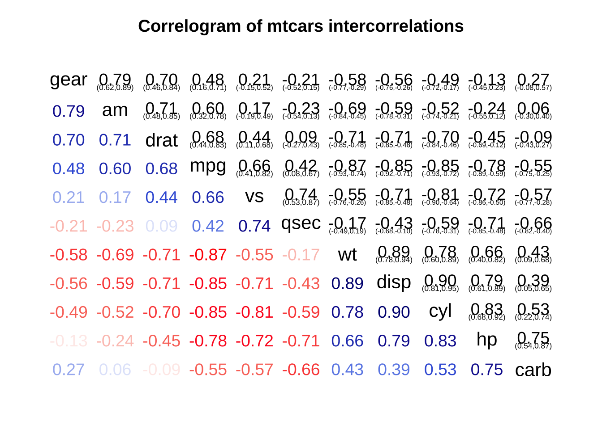


### 绘制其他图形

#### 核密度图

**概念介绍**：sm包中`sm.density.compare`函数用于绘制核密度图，核密度图如果想用一条密度曲线而不是通过柱状来展示连续型变量的分布。
 
**特点**：相比直方图，密度图的一个优势是可以堆放，可用于比较组间差异。`sm.density.compare`函数可以直接堆放多条密度曲线。使用格式如下。

`sm.density.compare(x ,group,….)`

其中x是数值向量，group是分组向量，是因子型数据。

```r
library(sm)      # 加载sm包
sm.density.compare(mtcars$wt, factor(mtcars$cyl))     # 绘制核密度图
```

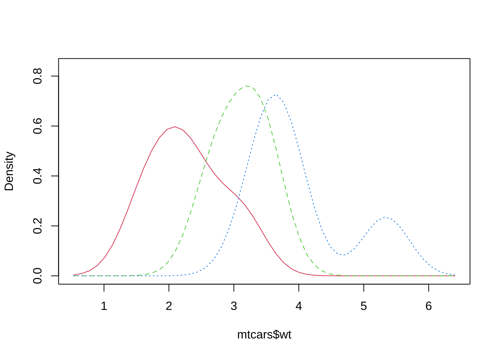

#### 小提琴图

**概念介绍**：vioplot包中的vioplot函数用于绘制小提琴图，小提琴图是核密度图与箱线图的结合，本质是利用密度值生成的多边形，但该多边形同时还沿着一条直线作了另一半对称的“镜像”，这样两个左右或上下对称的多边形拼起来就形成了小提琴图的主体部分，最后一个箱线图也会被添加在小提琴的中轴线上。

使用格式如下。

`vioplot( x , ...,  range=1.5,  h,  ylim, names,  horizontal=FALSE , …)`

其中，x为数据源，可以是向量；range默认等于1.5；col是为每幅小提琴图指定颜色的向量。


```r
library(vioplot)      # 加载vioplot包
attach(mtcars)
vioplot(wt[cyl==4], wt[cyl==6], wt[cyl==8],  border="black", 
        col = "gray60", rectCol = "blue", horizontal = TRUE,
        main = '小提琴图')  # 绘制小提琴图
```


```r
boxplot(wt~cyl, main = '箱线图', horizontal=TRUE,
        pars=list(boxwex=0.1), border="blue")  # 绘制箱线图
```


#### QQ图

**概念介绍**：查看经验分布和理论分布是否一致。将排序后的数据和理论分布的分位数进行比较后大致相等，说明了经验分布和理论分布相似。`qqplot()`函数用于绘制QQ图，QQ图检查数据是否服从某种分布。

使用格式如下:

`qqplot(x, y,,...);qqnorm(y,…) ; qqline(y)`

其中，x与y均为数据源，可以是向量。


```r
qqnorm(wt)     #正态分布QQ图
qqline(wt)      #QQ线
```

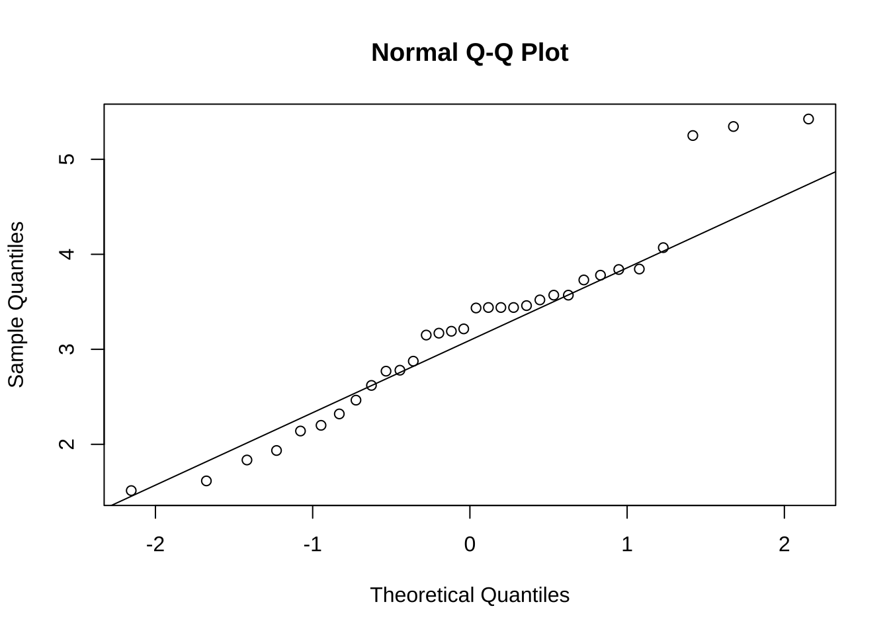

#### 等高图

**概念介绍**：数据形式：两个数值向量x、y和一个相应的矩阵z。x、y交叉组合之后形成的是一个“网格”，z是这个网格上的高度数值，将平面上对应的z值（高度）相等的点连接起来形成的线就是等高线。对x、y进行核密度估计，得到一个密度值矩阵，然后用x、y以及这个密度值矩阵作等高图。由于密度值反映的是某个位置上数据的密集程度，等高图就展示了一个聚类现象。

使用格式如下

`contour(x=,y=,z,nlevels=,levels=,labels= ,method=,...)`


```r
library(KernSmooth)  # 计算二维核密度的包
mtcars1 = data.frame(wt, mpg)
est = bkde2D(mtcars1, apply(mtcars1, 2, dpik))     # 计算二维核密度
contour(est$x1, est$x2, est$fhat, nlevels = 15, 
        col = "darkgreen", xlab = "wt", ylab = "mpg")  # 画等高图
points(mtcars1)  # 添加散点
```


## 修改图形参数

R是一个功能强大的图形构建平台,可以通过逐条输入语句构建图形元素（**颜色、点、线、文本以及图例**等），逐渐完善图形特征，直至得到想要的效果。图形元素的显示可以用图形函数和绘图参数来改良，也可以用绘制图形元素的基础函数来控制。


### 修改颜色

R语言通过设置绘图参数col来改变**图像、坐标轴、文字、点、线**等的颜色。关于颜色的函数大致可以分为下面三类：

#### 固定颜色选择函数

R语言提供了自带的固定种类的颜色，主要涉及的是colors函数，该函数可以生成657中颜色名称，代表657种颜色，可以通过以下代码查看R自带颜色的前20中颜色的名称。


```r
colors()[1:20] 
```

```
##  [1] "white"         "aliceblue"     "antiquewhite"  "antiquewhite1"
##  [5] "antiquewhite2" "antiquewhite3" "antiquewhite4" "aquamarine"   
##  [9] "aquamarine1"   "aquamarine2"   "aquamarine3"   "aquamarine4"  
## [13] "azure"         "azure1"        "azure2"        "azure3"       
## [17] "azure4"        "beige"         "bisque"        "bisque1"
```

```r
# colors()
plot(1:10,col = cm.colors(1))
```


通过palette函数固定调色板，只要设定好了调色板，它的取值就不会再改变（直到下一次重新设定调色板）。


```r
palette() #返回当前的调色板设置，此时为默认值
## [1] "black"   "#DF536B" "#61D04F" "#2297E6" "#28E2E5" "#CD0BBC" "#F5C710"
## [8] "gray62"
palette(colors()[1:10]) #重新设置调色板为colors的前10种颜色
palette()               #返回当前的调色板设置，此时为colors()的前10种颜色
##  [1] "white"         "aliceblue"     "antiquewhite"  "antiquewhite1"
##  [5] "antiquewhite2" "antiquewhite3" "antiquewhite4" "aquamarine"   
##  [9] "aquamarine"    "aquamarine2"
palette('default') #恢复默认的调色板设置
```

**例子**：

```r
plot(iris$Sepal.Length, iris$Sepal.Width, col = iris$Species)  
```

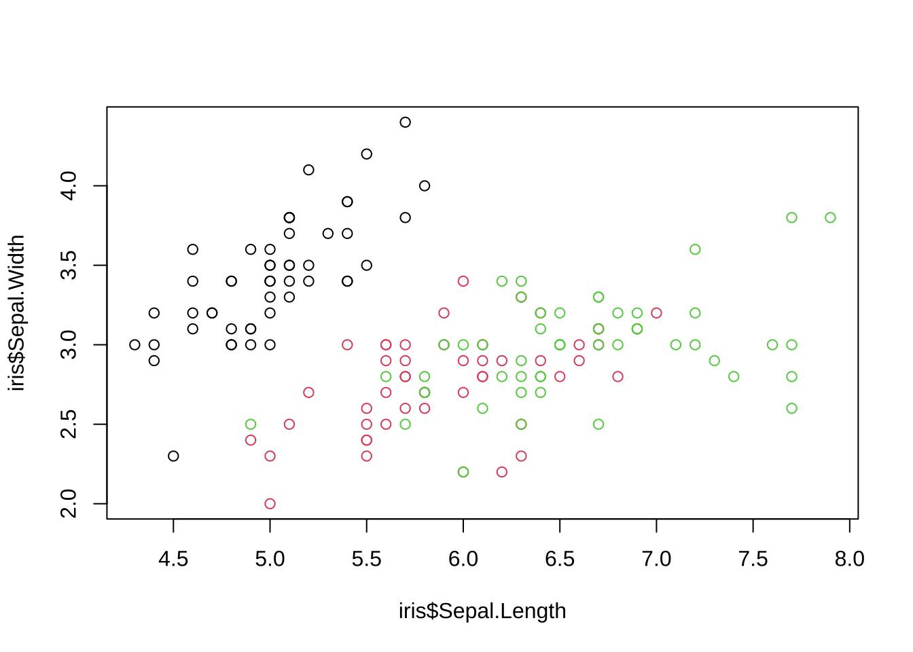

```r
# Species为因子型数据,setosa versicolor virginica分别对应数字1，2，3，
# 即等价于col = rep(1:3, each = 50)
```

#### 渐变色生成函数

除了固定颜色选择函数外，R还提供了一系列渐变颜色生成函数，这些函数用来控制颜色值**逐步变化**。


rgb函数把RGB颜色转化为十六进制数值，使用格式前四个参数都取值于区间[0, max]，names参数用来指定生成颜色向量的名称。red，green，blue参数的值越大就说明该颜色的成分越高。alpha指的是颜色的透明度，取0表示完全透明，取最大值表示完全不透明（默认完全不透明）。

`rainbow`函数、`heat.coclor`函数、`terrain.colors`函数、`topo.colors`函数、`cm.colors`函数是主题配色函数，使用格式中n设定产生颜色的数目，start和end设定彩虹颜色的一个子集，生成的颜色将从这个子集中选取。


#### RColorBrewer包

RColorBrewer包提供了3套配色方案，分别为**连续型，极端型以及离散型**。

- **连续型**（Sequential）指生成一系列连续渐变的颜色，通常用来标记连续型数值的大小。共18组颜色，每组分为9个渐变颜色展示。

- **极端型**（Diverging）指生成用深色强调两端、浅色标示中部的系列颜色、可用来标记数据中的离群点。共9组颜色，每组分为11个渐变颜色展示。

- **离散型**（Qualitative）指生成一系列彼此差异比较明显的颜色，通常用来标记分类数据。共8组颜色，每组渐变颜色数不同。


```r
par(mfrow = c(1,3))
library(RColorBrewer)
par(mar=c(0.1,3,0.1,0.1))
display.brewer.all(type="seq")
display.brewer.all(type="div")
display.brewer.all(type="qual")
```


```r
library(RColorBrewer)
my_col <- brewer.pal(3, 'RdYlGn') 
# brewer.pal(n,name),其中n为颜色的数量，name表示颜色组的名称
plot(iris$Sepal.Length, iris$Sepal.Width, col = rep(my_col, each =50))
```


```r
plot(iris$Sepal.Length, iris$Sepal.Width, col = rep(rainbow(3), each = 50))
```


### 修改点符号与线条

#### 点样式


```r
plot(iris$Sepal.Length, iris$Sepal.Width, pch = rep(1:3, each = 50))
```


```r
# plot(1:10,pch=21,cex=1.5,col='red',bg = "blue",lwd=5)
```

#### 线条样式

R语言提供了绘制不同类别的线条的多种函数，主要有

- lines：绘制曲线
- abline：绘制直线
- segments：绘制线段 
- arrows：在线段加上箭头
- grid：绘制网格线


以mtcars数据集为例来展示实际绘图过程中线条的应用。


```r
attach(mtcars)
smpg=(mpg-min(mpg))/(max(mpg)-min(mpg))
plot(wt,smpg,ylab="standardized mpg")
#添加核密度曲线图
lines(density(wt),col="red")
#指向密度曲线的箭头
arrows(1.8,0.05,1.5,0.1)
text(2,0.05,"density curve",cex=0.6)
#添加回归线
abline(lm(smpg~wt),lty=2,col="green")
#指向回归直线的箭头
arrows(2,0.5,2,0.7,angle=10,cex=0.5)
text(2,0.45,"regression line",cex=0.6)
#wt与mpg反向线性相关，添加最大最小值线段表现这种关系
segments(min(wt),max(smpg),max(wt),min(smpg),lty=3,col="blue")
#指向最大最小值线段的箭头
arrows(3,0.8,2.5,0.76,angle=10,cex=0.5)
text(3.3,0.8,"line segments",cex=0.6)
#添加网格线作为背景
grid(nx=4,ny=5,lty=2,col="grey")
```


#### 修改文本参数

title、text和mtext函数可以在打开的画布上添加文字元素。

- title可以添加标题元素；
- text可以任意位置添加文本;
- mtext函数则是在四条边上添加文本。


```r
par(mfrow = c(2, 2))
# 图一：图形添加标题
plot(c(0:5),col="red",xlab="",ylab="")
title(main=list("主标题",cex=1.5),sub=list("副标题",cex=1.2), 
      xlab="x轴标题",ylab="y轴标题")
# 图二：图形周边添加文本
plot(c(0:5),col="white")
mtext('side=1:下边',side=1,line=2)
mtext('side=2:左边' ,side=2,line=2)
mtext('side=3:上边' ,side=3)
mtext('side=4:右边' ,side=4)
# 图三：字体展示
plot(c(0:5),col="white")
text(2,4,labels="font=1:正常字体（默认）",font=1)
text(3,3,labels="font=2:粗体字体",font=2)
text(4,2,labels="font=3:斜体字体",font=3)
text(5,1,labels="font=4:粗斜体字体",font=4)
# 图四：字体大小展示
plot(c(0:6),col="white",xlim=c(1,8))
text(2,5,labels="cex=0.5:放大0.5倍",cex=0.5)
text(3,4,labels="cex=0.8:放大0.8倍",cex=0.8)
text(4,3,labels="cex=1(默认):正常大小",cex=1)
text(5,2,labels="cex=1.2:放大1.2倍",cex=1.2)
text(6,1,labels="cex=1.5:放大1.5倍",cex=1.5)
```


**例子**：


```r
attach(mtcars)
plot(wt, mpg, xlab = "Weight (1000 lbs)", 
     ylab = "Miles/(US) gallon") #绘图，并修改x，y轴的标题
title(main=list("mtcars wt V.S. mpg", cex=1.5))  # 添加标题
text(4.5, 34, labels = 'extracted from the 1974', cex = 1.5)  # 说明数据来源
text(4.5, 32, labels = 'Motor Trend US', font = 3)  # 杂志名称
```


#### 设置坐标轴

使用`axis()`进行设置坐标轴。


```r
plot(c(1:12), col="white", xaxt="n", yaxt="n", ann = FALSE)
axis(1, at=1:12, col.axis="red", labels=month.abb)
axis(2, at=seq(1,12,length=10), col.axis="red", labels=1:10, las=2)
axis(3, at=seq(1,12,length=7), col.axis="blue", cex.axis=0.7, 
     tck=-0.01, labels = c("Mon", "Tues", "Wed", "Thu", "Fri", "Sat", "Sun")) 
axis(4, at=seq(1,12,length=11), col.axis="blue", cex.axis=0.7, 
     tck=-0.01, labels=seq(0, 1, 0.1), las=2)
```

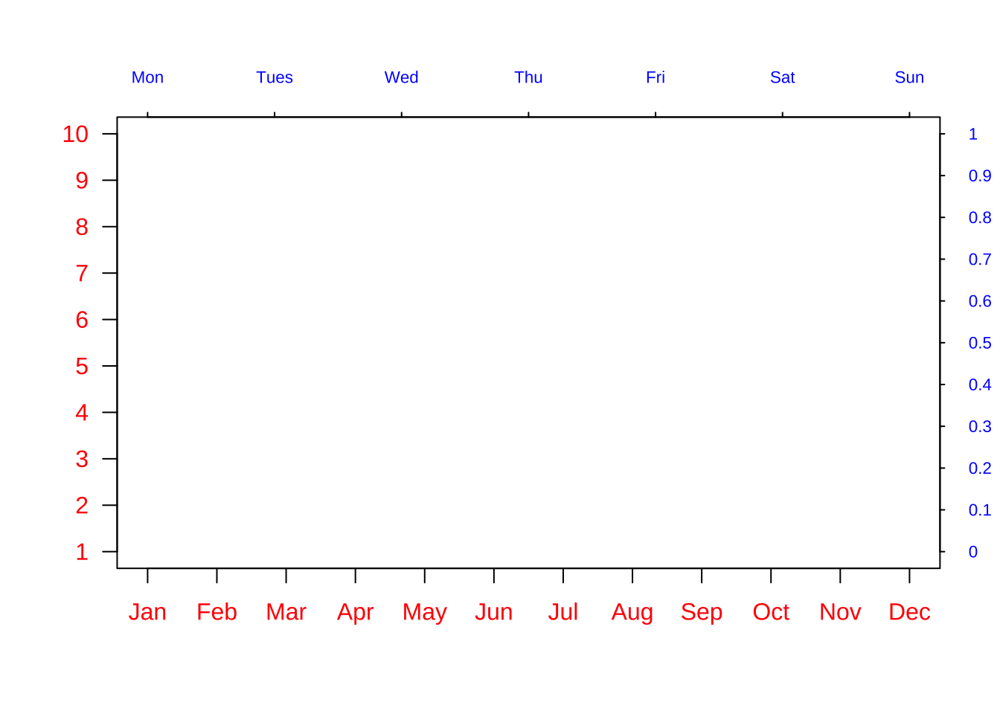


#### 添加图例

legend函数的绘制图例的位置效果

```r
local=c("bottomright", "bottom", "bottomleft", "left", "topleft",
        "top", "topright", "right", "center")
par(mar = c(4,2,4,2), pty='m')
plot(c(0:10), col = "white")
legend(3, 8, "图例在(3,8)")
for(i in 1:9){
  legend(local[i], paste("图例在", local[i]))
}
```

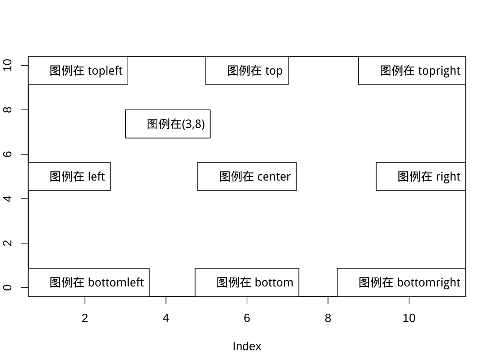

**综合测试**：

```r
plot(iris$Sepal.Length, iris$Sepal.Width, col = iris$Species, 
     main = list('鸢尾花的花萼长与宽的散点图', cex = 1.5), 
     xlab="花萼长度", ylab="花萼宽度",pch=19)
grid(nx=5, ny=5, lty=2, col="grey")  # 添加网格线
legend(7,4.5, c('setosa', 'versicolor', 'virginica'),
       pch=19, col = 1:3)  # 添加图例
lines(c(4.3, 6.5), c(2, 4.5), col ='blue')  # 添加直线
arrows(6, 4 , 6.5 ,4, angle=10, cex=0.5)  # 添加箭头
text(6.9, 4, "左上角全是setosa", cex=0.8)  # 添加文字说明
```


## 绘制组合图形

### par()

一页多图用mfrow参数或mfcol参数规定。  

```r
mfrow1=par(mfrow=c(2,3)) #mar=c(2,2,2,2)
for(i in 1:6){
  plot(c(1:i),main=paste("I'm image:",i))
}
```


```r
par(mfrow1)

op = par(mfrow=c(2,2))
plot(1:10,pch=12)
hist(1:10)
boxplot(1:10)
pie(1:10)
```


```r
par(op)
```

### layout

与par函数均分画布不同，layout函数可以不均等的分隔页面

```r
mat<-matrix(c(1,1,1,2,3,3,4,4,5,5,5,6), nrow = 2, byrow = TRUE)
layout(mat)
for(i in 1:6){
  plot(c(1:i),main=paste("I'm image:",i))
}
```


## 保存图形 

### 使用代码

对于其他格式输出类似pdf的输出。

```r
pdf("test/2.pdf")  # 保存到当前工作目录下
plot(1:10)
dev.off()
```

```
## quartz_off_screen 
##                 2
```

### 在 Rstudio 窗口点击按钮保存

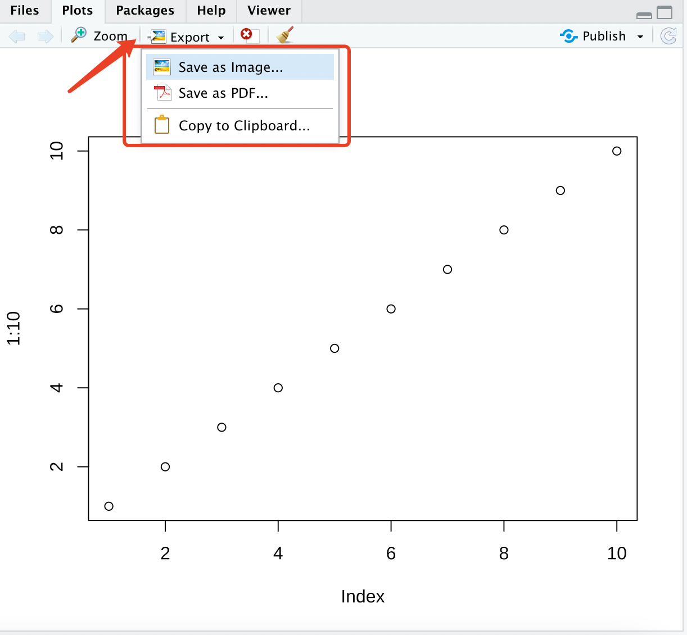

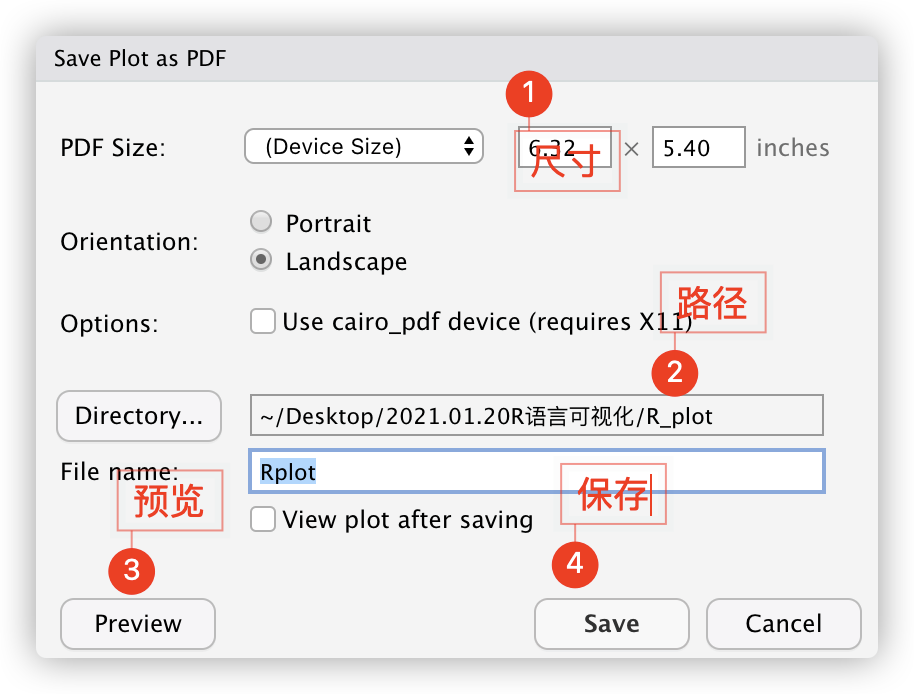


