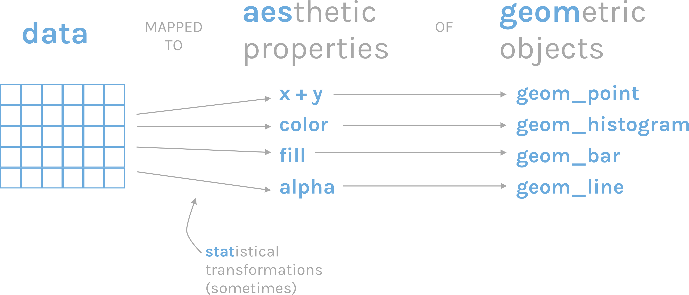
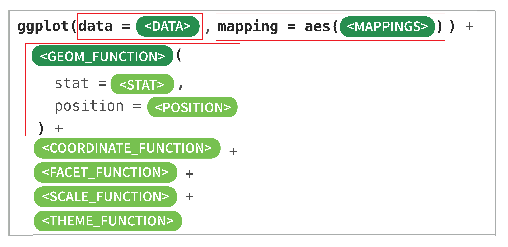
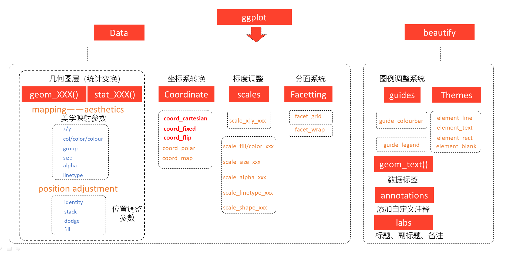
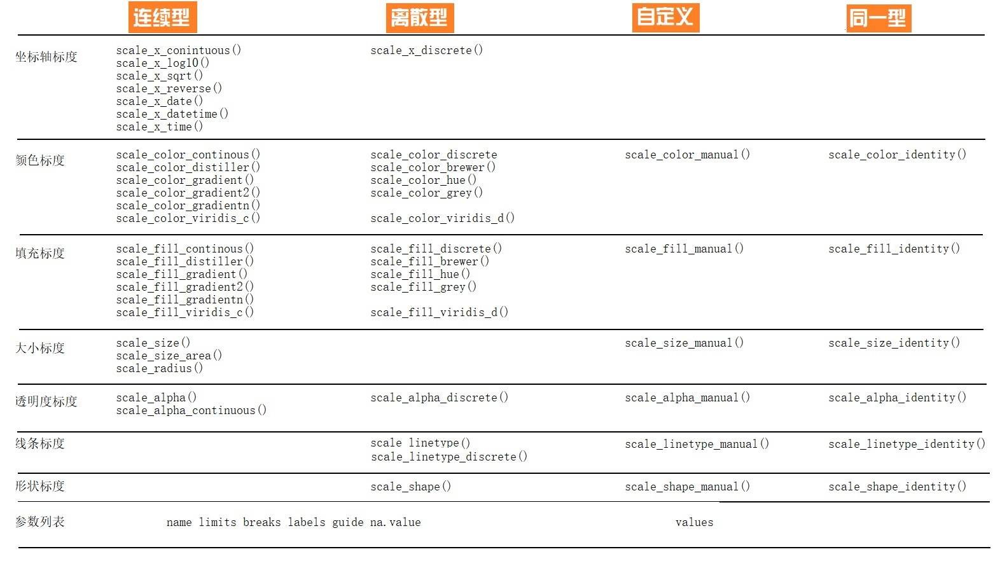

# 使用 ggplot2 包绘图 {#ggplot2-plot}


## 简介

ggplot2 包是 Harley
Wickham 在 2005 年创建的，是包含了一套全面而连贯的语法的绘图系统。


弥补了R中创建图形缺乏一致性的缺点，且不会局限于一些已经定义好的统计图形，可以根据需要创造出任何有助于解决所遇到问题的图形。

**核心理念**：将绘图与数据分离，数据相关的绘图与数据无关的绘图分离，**按图层作图**。

## qplot

`ggplot2`包的绘图语言与常用的绘图函数的使用方法不同，为了让读者快速使用`ggplot2`包，包的作者Harley
Wickham提供了`qplot`函数（quick
plot），让人在了解`ggplot2`的语言逻辑之前，就能迅速实现数据的可视化。

鸢尾花数据集`iris`


```r
head(iris,10)
```

```
##    Sepal.Length Sepal.Width Petal.Length Petal.Width Species
## 1           5.1         3.5          1.4         0.2  setosa
## 2           4.9         3.0          1.4         0.2  setosa
## 3           4.7         3.2          1.3         0.2  setosa
## 4           4.6         3.1          1.5         0.2  setosa
## 5           5.0         3.6          1.4         0.2  setosa
## 6           5.4         3.9          1.7         0.4  setosa
## 7           4.6         3.4          1.4         0.3  setosa
## 8           5.0         3.4          1.5         0.2  setosa
## 9           4.4         2.9          1.4         0.2  setosa
## 10          4.9         3.1          1.5         0.1  setosa
```

```r
str(iris)
```

```
## 'data.frame':	150 obs. of  5 variables:
##  $ Sepal.Length: num  5.1 4.9 4.7 4.6 5 5.4 4.6 5 4.4 4.9 ...
##  $ Sepal.Width : num  3.5 3 3.2 3.1 3.6 3.9 3.4 3.4 2.9 3.1 ...
##  $ Petal.Length: num  1.4 1.4 1.3 1.5 1.4 1.7 1.4 1.5 1.4 1.5 ...
##  $ Petal.Width : num  0.2 0.2 0.2 0.2 0.2 0.4 0.3 0.2 0.2 0.1 ...
##  $ Species     : Factor w/ 3 levels "setosa","versicolor",..: 1 1 1 1 1 1 1 1 1 1 ...
```

-   **例子一：**

创建一个以物种种类为分组的花萼长度的箱线图，箱线图的颜色依据不同的物种种类而变化。


```r
library(ggplot2)
qplot(Species, Sepal.Length, data = iris, geom = "boxplot",
      fill = Species,main = "依据种类分组的花萼长度箱线图")
```


```r
boxplot(Sepal.Length~Species,data =iris,main = "依据种类分组的花萼长度箱线图")
```


-   **例子二：**

利用`qplot`函数画出小提琴图，只需要将`geom`设置为`“violon”`即可，并添加扰动以减少数据重叠。


```r
qplot(Species, Sepal.Length, data = iris, geom = c("violin", "jitter"), 
      fill = Species,main = "依据种类分组的花萼长度小提琴图")
```


-   **例子三：**

建一个以花萼长度和花萼宽度的散点图，并利用颜色和符号形状区分物种种类。


```r
qplot(Sepal.Length, Sepal.Width, geom = "point",data = iris, colour = Species, 
      shape = Species,main = "绘制花萼长度和花萼宽度的散点图")
```


-   **例子四：**

利用facets参数绘制分面板散点图,并增加光滑曲线。


```r
qplot(Sepal.Length, Sepal.Width, data = iris, geom = c("point", "smooth"),
      facets = ~Species,main = "绘制分面板的散点图")
```


## ggplot2包图形语法

**推荐书籍**：

ggplot2: Elegant Graphics for Data Analysis <https://ggplot2-book.org/>

Fundamentals of Data Visualization <https://clauswilke.com/dataviz/>


### 对比不同画图语法

以绘制iris数据集中Sepal.Length与Sepal.Width的散点图为例，分别采用内置的plot函数与ggplot2包的ggplot函数绘制散点图，对比理解ggplot2包的语言逻辑。

代码（三种类型）：


```r
# 基础包
plot(iris$Sepal.Length, iris$Sepal.Width)
```


```r
# qplot()
qplot(x = Sepal.Length, y = Sepal.Width,data = iris,geom = "point")
```


```r
# ggplot()
ggplot(data= iris, aes(x = Sepal.Length, y = Sepal.Width)) +  #绘制底层画布
geom_point()  #在画布上添加点
```


### 思想介绍

**注：**该部分主要参考[数据科学中的R语言------王敏杰](https://bookdown.org/wangminjie/R4DS/intro-R.html#%E5%AE%89%E8%A3%85-rstudio)。

ggplot的绘图有以下几个特点。

1.  有明确的起始（以ggplot函数开始）与终止（一句语句一幅图）。

2.  ggplot2语句可以理解为一句语句绘制一幅图，然后进行图层叠加，而叠加是通过"+"号把绘图语句拼接实现的。

ggplot函数包括9个部件：

-   数据 (data) （ 数据框）
-   映射 (mapping)
-   几何对象 (geom_point() , geom_boxplot())
-   统计变换 (stats)
-   标度 (scale)
-   坐标系 (coord)
-   分面 (facet)
-   主题 (theme)
-   存储和输出 (output)

其中前三个是必需的。

Hadley
Wickham将这套可视化语法诠释为：一张统计图形就是从**数据**到**几何对象**(geometric
object，缩写geom)的**图形属性**(aesthetic
attribute，缩写aes)的一个映射。

 

此外，图形中还可能包含数据的**统计变换**(statistical
transformation，缩写stats)，最后绘制在某个特定的**坐标系**(coordinate
system，缩写coord)中，而**分面**(facet)则可以用来生成数据不同子集的图形。





**例子（带你入门）**


```r
ggplot(data = iris, mapping = aes(Petal.Length,Petal.Width)) +
  geom_point(size = 2,alpha = 0.5,col ="red") +
  geom_smooth(method = "lm",se = F)
```


### 全局变量 vs. 局部变量


```r
ggplot(data = iris, mapping = aes(x = Petal.Length,y = Petal.Width, col = Species)) +
  geom_point() 
```


```r
ggplot(data = iris) +
  geom_point(mapping = aes(x = Petal.Length,y = Petal.Width, col = Species))
```


大家可以看到，以上两段代码出来的图是一样。但背后的含义却不同。

**例子(观察两者之间的区别)**


```r
#版本一
ggplot(data = iris, mapping = aes(x = Petal.Length,y = Petal.Width, col = Species)) +
  geom_point() + 
  geom_smooth() 
```


```r
# 版本二
ggplot(data = iris, mapping = aes(x = Petal.Length,y = Petal.Width)) +
  geom_point(mapping = aes(col = Species)) + 
  geom_smooth()
```


## 几何对象

`geom_xxx()`提供了各种基本图形。 列表如下：

-   基础图形：

    -   `geom_blank()`不画图，可以按映射的变量设定坐标范围；
    -   `geom_point()`每个观测为一个散点；
    -   `geom_hline()`, `geom_vline()`, `geom_abline()`画线；
    -   `geom_path()`每个观测提供坐标，在相邻观测之间连线；
    -   `geom_ribbon()`需要x和ymin,
        ymax维，在从小到大排序后的相邻观测之间连接阴影区域；
    -   `geom_segment()`需要x, y和xend, yend，为每个观测画一条线段；
    -   `geom_rect()`需要xmin, xmax, ymin,
        ymax，为每个观测画一个长方形，可有填充色；
    -   `geom_polygon()`需要x,
        y，将相邻观测连续并连接成一个闭合的多边形，中间填充颜色；
    -   `geom_text()`需要x, y和lable，每个观测画一条文字标签。

-   单变量图层：

    -   `geom_bar()`, `geom_col()`作条形图；
    -   `geom_histogram()`对连续变量x作直方图；
    -   `geom_density()`对连续变量x作一元密度估计曲线；
    -   `geom_dotplot()`用原点作直方图；
    -   `geom_freqpoly()`用折线作直方图。

-   两变量图形：

    -   两个连续变量x, y：

        -   `geom_point()`散点图；
        -   `geom_quantile()`拟合分位数回归曲线；
        -   `geom_rug()`在坐标轴处画数值对应的短须线；
        -   `geom_smooth()`画各种拟合曲线；
        -   `geom_text()`在指定的x, y位置画label给出的文字标签；

    -   显示二元分布:

        -   `geom_bin2d()`作长方形分块的二维直方图；
        -   `geom_density2d()`作二元密度估计等值线图；
        -   `geom_hex()`作正六边形分块的二维直方图。

    -   两个变量中有分类变量时：

        -   `geom_count()`：重叠点越多画点越大；
        -   `geom_jitter()`:
            随机扰动散点位置避免重叠，数值变量有重叠时也可以用；

    -   一个连续变量和一个分类变量：

        -   `geom_col()`作条形图，对分类变量的每个值画一个条形，长度与连续变量值成比例；
        -   `geom_boxplot()`对每个类做一个盒形图；
        -   `geom_violin()`对每个类做一个小提琴图。

    -   一个时间变量和一个连续变量：

        -   `geom_area()`作阴影曲线图，曲线下方填充阴影色；
        -   `geom_line()`作折线图，在相邻两个时间之间连接线段；
        -   `geom_step()`作阶梯函数图，在相邻两个时间之间连接阶梯函数线。

    -   不确定性：

        -   `geom_crossbar()`对每个观测输入的x, y, ymin,
            ymax画中间有线的纵向条形；
        -   `geom_errbar()`对每个观测输入的x, ymin, ymax画纵向误差条；
        -   `geom_linerange()`对每个观测输入的x, ymin, ymax画一条竖线；
        -   `geom_pointrnage()`对每个观测输入的x, y, ymin,
            ymax画一条中间有点的竖线。

-   地图：

    -   `geom_map()`: 用区域边界坐标数据画边界线地图。

-   三个变量：

    -   `geom_contour()`: 用输入的x, y, z数据画等值线图。

    -   `geom_tile()`用输入的x, y位置, width,
        height大小和指定的fill维画长方形色块填充图。

    -   `geom_raster()`是`geom_tile()`的长方形大小相同时的快速版本。

### 参考书籍

由于这部分内容非常的多，短短两小时不可能讲完，这里给了一些参考资料，各个都是满满的干货。

-   [数据科学中的R-第14章ggplot之集合对象](https://bookdown.org/wangminjie/R4DS/ggplot2-geom.html#%E5%9F%BA%E6%9C%AC%E7%BB%98%E5%9B%BE)

-   [R语言教程第30节-ggplot各种图形](https://www.math.pku.edu.cn/teachers/lidf/docs/Rbook/html/_Rbook/ggplotvis.html)

-   [Top 50 ggplot2
    Visualizations](http://r-statistics.co/Top50-Ggplot2-Visualizations-MasterList-R-Code.html)

-   [Chapter 3: Data
    Visualisation](http://r4ds.had.co.nz/data-visualisation.html) of *R
    for Data Science*

-   [Chapter 28: Graphics for
    communication](http://r4ds.had.co.nz/graphics-for-communication.html)
    of *R for Data Science*

-   [Graphs](https://r-graphics.org/) in *R Graphics Cookbook*

## 统计变换

**概念**：对数据所应用的统计类型/方法。

ggplot2为每一种几何类型指定了一种默认的统计类型，如果仅指定geom或stat中的一个，另外一个会自动获取。其中，stat_identity则表示不做任何的统计变换。

**示例**：只需指定geom或stat中的一个，具体细小细节可以参考这
<https://bookdown.org/wangminjie/R4DS/ggplot2-stat-layer.html>


```r
ggplot(iris) + 
  geom_bar(aes(x=Sepal.Length), stat="bin", binwidth = 0.5)
```


```r
ggplot(iris) + 
  stat_bin(aes(x=Sepal.Length), geom="bar", binwidth = 0.5)
```


## 刻度scale

这一节我们一起学习ggplot2中的scales语法，推荐大家阅读Hadley
Wickham最新版的[《ggplot2: Elegant Graphics for Data
Analysis》](https://ggplot2-book.org/)，但如果需要详细了解**标度**参数体系，还是要看[ggplot2官方文档](https://cran.r-project.org/web/packages/ggplot2/index.html)

在`ggplot()`的mapping参数中指定x维、y维、color维等，实际上每一维度都有一个**对应的默认刻度**(scale)，即，将**数据值映射到图形中的映射方法**。

如果需要修改刻度对应的变换或者标度方法，可以调用相应的scale_xxx()函数。

**画图都没用到scale啊！**

能画个很漂亮的图，那是因为ggplot2默认缺省条件下，已经很美观了。（据说Hadley
Wickham很后悔使用了这么漂亮的缺省值，因为很漂亮了大家都不认真学画图了。马云好像也说后悔创立了阿里巴巴？）


```r
#解释
ggplot(data = iris, mapping = aes(x = Petal.Length,y = Petal.Width, col = Species)) +
  geom_point() + 
  geom_smooth() 
```


### 丰富的刻度体系

**注意：**标度函数是由"\_"分割的三个部分构成的 - scale - 视觉属性名
(e.g., colour, shape or x) - 标度名 (e.g., continuous, discrete,
brewer).

-   将数据变量映射到具体的位置、颜色、填充色、大小、符号等。



每个标度函数内部都有丰富的参数系统

    scale_colour_manual(
      palette = function(), 
      limits = NULL,
      name = waiver(),
      labels = waiver(),
      breaks = waiver(),
      minor_breaks = waiver(),
      values = waiver(),
      ...
    )

-   参数`name`，坐标和图例的名字，如果不想要图例的名字，就可以
    `name = NULL`

-   参数`limits`,
    坐标或图例的范围区间。连续性`c(n, m)`，离散型`c("a", "b", "c")`

-   参数`breaks`, 控制显示在坐标轴或者图例上的值（元素）

-   参数`labels`, 坐标和图例的间隔标签

    -   一般情况下，内置函数会自动完成
    -   也可人工指定一个字符型向量，与`breaks`提供的字符型向量一一对应
    -   也可以是函数，把`breaks`提供的字符型向量当做函数的输入
    -   `NULL`，就是去掉标签

-   参数`values` 指的是（颜色、形状等）视觉属性值,

    -   要么，与数值的顺序一致；
    -   要么，与`breaks`提供的字符型向量长度一致
    -   要么，用命名向量`c("数据标签" = "视觉属性")`提供

-   参数`expand`, 控制参数溢出量

-   参数`range`, 设置尺寸大小范围，比如针对点的相对大小

下面，我们通过具体的案例讲解如何使用参数，把图形变成我们想要的模样。

**例子**：随机从iris数据集的150个样本中抽取100个样本，并绘制条形图反映100个样本中各个鸢尾花种类的数量情况。然后通过修改标尺参数做前后对比图，进而理解标尺在ggplot2包中的作用。


```r
set.seed(1)  # 设置随机种子
my_iris <- iris[sample(1:150, 100, replace = FALSE),]  # 随机抽样

p <- ggplot(my_iris) + 
  geom_bar(aes(x = Species, fill = Species))
p
```


```r
p + scale_fill_manual(
    values = c("orange", "red", "lightyellow3"),  # 颜色设置
    name = NULL,  # 图例和轴使用的名称
    labels = c("set", "ver", "vir")  # 图例使用的标签
)  + 
  scale_x_discrete(labels = c("set", "ver", "vir"),name = "A") +
  scale_y_continuous(name = "B",breaks = c(20,40)) +
  theme_bw()
```


使用`scale_color_manual`或`scale_color_brewer`函数修改图形的颜色。在对iris数据集中的Sepal.Length与Sepal.Width的散点图分别使用以上两种方法修改散点颜色


```r
#图一：使用scale_color_manual函数
ggplot(iris, aes(x = Sepal.Length, y = Sepal.Width, colour = Species))+
  geom_point(size = 2) +
  scale_color_manual(values = c("orange", "olivedrab", "navy"),
                     name = NULL) 
```


```r
#图二:使用scale_color_brewer函数
ggplot(iris,aes(x = Sepal.Length, y = Sepal.Width, colour = Species))+
  scale_color_grey()+
  geom_point(size=2) 
```


```r
# library(RColorBrewer)
# brewer.pal(3, "Set1")
# display.brewer.all()
```

## 坐标系

ggplot2默认的坐标系是笛卡尔坐标系，可以用如下方法指定取值范围：`coord_cartesian(xlim = c(0,5), ylim = c(0, 3))`。

`coord_flip`：x轴和y轴换位置。

`coord_polar(theta = "x",direction=1)`是角度坐标系,theta指定角度对应的变量，start指定起点离12点钟方向的偏离值，direction若为1表示顺时针方向，若为-1表示逆时针方向。


```r
# 饼图 = 堆叠长条图 + polar_coordinates
pie <- ggplot(my_iris, aes(x = factor(1), fill = Species)) +
  geom_bar(width = 1)
pie + coord_polar(theta = "y",direction = -1,start = 30)
```


```r
# 靶心图 = 饼图 + polar_coordinates
pie + coord_polar()
```


```r
#锯齿图 = 柱状图 + polar_coordinates
cxc <- ggplot(my_iris, aes(x = Species)) +
  geom_bar(width = 1, colour = "black")
cxc + coord_polar()
```


## 分面

分面，就是分组绘图，根据定义的规则，将数据分为多个子集，每个子集按照统一的规则单独制图，排布在一个页面上。

ggplot2提供两种分面方法：`facet_grid`函数和`facet_wrap`函数。

**1. facet_grid函数**

注意`facet_grid`函数是一个二维的矩形布局，每个子集的位置由行位置变量\~列位置变量的决定


```r
library(ggplot2)
library(tidyr)
library(dplyr)
my_iris1 <- iris %>% gather(feature_name, feature_value, one_of(c("Sepal.Length", "Sepal.Width", "Petal.Length", "Petal.Width")))  # 数据变换
ggplot(my_iris1) + 
  geom_violin(aes(x = Species, y = feature_value)) +  # 绘制小提琴图
  facet_grid(feature_name ~ Species, scales = "free")  # 分面
```


```r
# iris例子
ggplot(data = iris, mapping = aes(x = Sepal.Length, y = Sepal.Width)) +  # 底层画布
  geom_point() +
  geom_smooth() +
  facet_grid(~Species)
```


**2. facet_wrap函数**

facet_wrap函数生成一个动态调整的一维布局，根据"\~位置变量1+位置变量2+..."来确定每个子集的位置，先逐行排列，放不下了移动到下一行。


```r
ggplot(my_iris1) +
  geom_violin(aes(x = Species, y = feature_value)) +
  facet_wrap(~ feature_name + Species, scales = "free_y",nrow = 3,
             strip.position = "bottom")
```


```r
# iris例子
ggplot(data = iris, mapping = aes(x = Sepal.Length, y = Sepal.Width)) +  # 底层画布
  geom_point() +
  geom_smooth()+
  facet_wrap(~Species)
```


## 标题、标注、指南、拼接

除了`ggplot()`指定数据与映射，`geom_xxx()`作图，还可以用许多辅助函数增强图形。

-   `labs()`可以设置适当的标题和标签。
-   `annotate()`函数可以直接在坐标系内进行*文字、符号、线段、箭头、长方形*的绘制。
-   `guides()`函数可以控制图例的取舍以及做法。
-   `theme()`函数可以控制一些整体的选项如背景色、字体类型、图例的摆放位置等。

### 标题

函数`labs()`可以用来指定图形上方的`标题(title)`、`副标题(subtitle)`、右下方的`标注(caption)`、`左上方的标签`以及`坐标轴标题`和其它维的名称。
例如：


```r
library(gapminder)
p <- ggplot(data = gapminder,
  mapping = aes(
    x = gdpPercap,
    y = lifeExp))
p + geom_point(alpha = 0.4) + 
  labs(
    title = "各国各年度人均GDP与期望寿命的关系",
    subtitle = "1952-2007",
    tag = "散点图",
    caption = "数据来源：gapminder",
    x = "人均GDP(单位：美元)",
    y = "期望寿命"
  )
```


```r
#iris案例
ggplot(data = iris, mapping = aes(x = Sepal.Length, y = Sepal.Width)) +  # 底层画布
  geom_point() +
  geom_smooth() +
  labs(
    title = "22",
    subtitle = "22",
    caption = "22"
  )
```


`labs()`只是提供了这些标题功能，一般并不会同时使用这些功能。
在出版图书内，图形下方一般伴随有图形说明，这时一般就不再使用标题、副标题、标签、标注，而只需写在图的伴随说明文字中，当然，坐标轴标签一般还是需要的。

### 标注功能

通过`annotate(geom = "text")`调用`geom_text()`的功能，
可以在一个散点图中标注多行文字，多行之间用`"\n"`分开：

在`annotate()`中选`geom="rect"`，给出长方形的左右和上限界限，
可以将上面图形中最右侧偏低的点用长方形填充标出。
可以在`annotate()`中选`geom="line"`画线，需要给出线的起点和终点坐标，可以`arrow`选项要求画箭头，用`arrow()`函数给出箭头的大小、角度等设置，
如：


```r
p + geom_point() +
  geom_smooth(method="gam") +
  scale_x_log10() +
  annotate(geom = "rect", 
           xmin = 5.5E4, xmax = 1.2E5,
           ymin = 54, ymax = 71,col = 'red',fill = 'red',alpha = 0.5) + 
  annotate(geom = "line",
           x = c(5.9E4, 3.16E4),
           y = c(53,  40),
           arrow = arrow(angle = 20, length = unit(4, "mm"))) +
  annotate(geom = "text",
           x = 3.16E4, y = 38,
           label = "这些国家的期望寿命低于预期")
```


```r
#iris例子 + annotate，hline，abline
ggplot(data = iris, mapping = aes(x = Sepal.Length, y = Sepal.Width)) +  # 底层画布
  geom_point() +
  geom_smooth() 
```


可以用`geom_hline()`、`geom_vline()`和`geom_abline()`画横线、竖线、斜线。
ggplot2的默认主题会自动画参考线，可以用`theme()`函数指定参考线画法。

### 指南

对于颜色、填充色等维度，
会自动生成图例。用`guides(color = FALSE)`这样的方法可以取消指定维度的图例。

`theme()`可以调整一些整体的设置，如背景色、字体、图例的摆放位置。

**例如：**用`theme()`的`legend.position`改变图例的位置，
如`theme(legend.position = "top")`可以将图例放置在上方，
默认是放置在右侧的。可取值有`"none"、"left"、"right"、"bottom"、"top"`，如：


```r
#iris 例子
ggplot(data = iris, mapping = aes(x = Sepal.Length, y = Sepal.Width,col = Species)) +  # 底层画布
  geom_point() +
  geom_smooth() +
  theme(legend.position = 'left',panel.background = element_blank()) +theme_bw()
```


### 主题

ggplot2包作图可以实现内容与设计的分离，这里内容就是指数据、映射、统计、图形类型等方面，而设计就是指背景色、颜色表、字体、坐标轴做法、图例位置等的安排。将作图任务分解为内容与设计两个方面，可以让数据科学家不必关心设计有关的元素，而设计可以让专门的艺术设计人才来处理。这种工作分配已经在图书出版、网站、游戏开发等行业发挥了重要作用。

theme()函数用来指定设计元素，称为主题(theme)，而且可以单独开发R扩展包来提供适当的主题。**ggthemes扩展包**是一个这样的包。

`theme_set()`可以改变后续ggplot2作图的主题（配色、字体等）。如`theme_set(theme_bw()),theme_set(theme_dark())`等。
对单次绘图，可以直接用加号连接`theme_gray()`等这些主题函数。
主题包括`theme_gray()（默认主题）、theme_minimal()、theme_classic()`等。

`theme()`函数还可以直接指定颜色、字体、大小等设置。


```r
#iris 例子
```

## 保存图片

ggplot2包中提供ggsave函数进行图形保存。ggsave函数的使用格式如下所示。

`ggsave(filename,width,height,...)`

其中，filename为保存的文件名与路径，width指图像宽度，height指图像高度。

**示例：**运行下列代码将会在当前工作目录下生成一个名为mygraph的pdf图形。


```r
ggplot(iris, aes(x = Sepal.Length, y = Sepal.Width, colour = Species))+
  geom_point(size = 2)
```


```r
ggsave(file = "mygraph1.png", width = 6, height = 8)
```

或者可以使用Rstudio界面进行保存图片，具体教程课件（R语言可视化基础教程）

## 例子

该部分来源于：公众号[小明的数据分析笔记本]。大家可以通过以下例子对今天所学的知识进行回顾。

### 柱状图+误差项


```r
## 小明推送笔记《小明的数据分析笔记本》
# 跟着Nature microbiology学画图~R语言ggplot2画柱形图 
# https://mp.weixin.qq.com/s/E-1X_VSq03AhvC_0cNEgyQ

library(ggplot2)

### 柱状图+误差项
data = data.frame("group" = c("A","B"),"value"=c(0.8,0.4),"errorbar"=c(.2,.1))
data
```

```
##   group value errorbar
## 1     A   0.8      0.2
## 2     B   0.4      0.1
```

```r
p1 = ggplot(data,aes(x = group, y = value)) +
  geom_col(aes(fill=group),color="black") +  #柱状图
  geom_hline(yintercept = 1,lty = 2) + #加横线
  geom_hline(yintercept = 0.5,lty = "dashed") +
  theme_bw() + #主题设置
  theme(panel.grid = element_blank(), #网格为空
        legend.position = "none") + #legend位置为无，就是不加
  scale_y_continuous(expand = c(0,0),limits = c(0,1.5)) +  #y为连续，设置ylim
  scale_x_discrete(label = c("Ositive \n interactions","Negative\ninteractions")) + #x为离散
  annotate("segment",x=1,y=0.8,xend=1,yend=1) + #加线段segment，当然这个函数可以加很多其他的包括字
  annotate("segment",x=2,y=0.4,xend=2,yend=0.5) +
  labs(x = NULL,  #标签，注意\n可以空行
       y = 'Absolute fold change\nin growth from co-cultures\ncompared to monocultures',
       title = "Average growth fold change in\nco-cultures") +
  annotate("segment",x=1,y=1,xend=1.2,yend=1.05) +
  annotate("segment",x=2,y=1,xend=1.8,yend=1.05) + 
  annotate("segment",x=1.2,y=1.05,xend=1.8,yend=1.05) + 
  annotate("text", x = 1.5, y = 1.1, label = "p=0.005" ) + 
  scale_fill_manual(values = c("#ff8080","#90bff9")) #填充色使用离散颜色manual，两种颜色这里。
p1
```


### 有正值和负值的柱形图


```r
## 有正值和负值的柱形图

x <- 1:28
y <- sample(-100:150,28,replace = F)
df2 <- data.frame(x,y)
df2$x = as.factor(df2$x)
df2$group <- ifelse(df2$y>0,"A","B")
df2$group<-factor(df2$group,
                  labels = c("Synergistic interactions",
                             "Non-synergistic interactions"))
head(df2)
```

```
##   x    y                        group
## 1 1   62     Synergistic interactions
## 2 2  -58 Non-synergistic interactions
## 3 3 -100 Non-synergistic interactions
## 4 4  -72 Non-synergistic interactions
## 5 5  -23 Non-synergistic interactions
## 6 6   49     Synergistic interactions
```

```r
p2 = ggplot(df2,aes(x,y)) + 
  geom_col(aes(fill = group),col = "black") + 
  geom_hline(yintercept = 100,lty = "dashed") +
  geom_hline(yintercept = 50,lty = "dashed") +
  geom_hline(yintercept = -50,lty = "dashed") +
  theme_bw() +
  theme(panel.grid = element_blank(),
        axis.text.x = element_text(angle = 90,hjust = 0.5,
                                   vjust = 0.5),
        plot.title = element_text(hjust = 0.5),
        legend.position = "bottom",
        legend.title = element_blank()) + #取消标签的名称
  scale_y_continuous(expand = c(0,0),
                     limits = c(-100,150),
                     breaks = c(-100,-50,0,50,100,150)) +
  labs(x="Pairwise interactions",
       y="Percentage change from\nmonoculture",
       title = "Synergistic versus non-synergistic\ninteractions") + #标签说明
  scale_fill_manual(values = c("#ff8080","#90bff9"))
p2  
```


### 合并两图

合并两图或者多图可以使用以下包：

-   `cowplot`包的`plot_grid()`
-   `pathwork`包
-   `gridEctra`包的`grid.arrange()`

具体可以参考我公众号的这篇推文[R可视乎｜合并多幅图形](https://mp.weixin.qq.com/s/goFqnPtH85oXAwlxcacRDw)

这里使用了cowplot包


```r
## 合并两图（使用cowplot包）
library(cowplot)
pdf("test/plot_cow.pdf",width = 8,height = 4)
plot_grid(p1,p2,ncol = 2,nrow = 1,labels = c("d","e"))
dev.off()
```

```
## quartz_off_screen 
##                 2
```

