# 常用图形{#main-diagram-types}


<!-- <iframe src="https://docs.google.com/presentation/d/e/2PACX-1vR4pD2EmW9Gzxr1Q3qwgjEYkU64o2-ThlX1mXqfNQ2EKteVUVt6Qg2ImEKKi9XLv-Iutb3lD8esLyU7/embed?start=false&loop=false&delayms=3000" frameborder="0" width="960" height="569" allowfullscreen="true" mozallowfullscreen="true" webkitallowfullscreen="true"></iframe> -->


```r
library(tidyverse)
library(ggExtra)
library(ragg)
library(ggalluvial)
library(treemapify)
library(ggalt)
library(palmerpenguins)
```


```r
head(penguins)
```

```
## # A tibble: 6 × 8
##   species island bill_length_mm bill_depth_mm flipper_length_… body_mass_g sex  
##   <fct>   <fct>           <dbl>         <dbl>            <int>       <int> <fct>
## 1 Adelie  Torge…           39.1          18.7              181        3750 male 
## 2 Adelie  Torge…           39.5          17.4              186        3800 fema…
## 3 Adelie  Torge…           40.3          18                195        3250 fema…
## 4 Adelie  Torge…           NA            NA                 NA          NA <NA> 
## 5 Adelie  Torge…           36.7          19.3              193        3450 fema…
## 6 Adelie  Torge…           39.3          20.6              190        3650 male 
## # … with 1 more variable: year <int>
```

```r
#head(penguins_raw)
```


- set [colorblind-friendly palettes](https://jfly.uni-koeln.de/color/)


```r
# The palette with grey:
cbp1 <- c("#999999", "#E69F00", "#56B4E9", "#009E73",
          "#F0E442", "#0072B2", "#D55E00", "#CC79A7")

# The palette with black:
cbp2 <- c("#000000", "#E69F00", "#56B4E9", "#009E73",
          "#F0E442", "#0072B2", "#D55E00", "#CC79A7")

library(plotrix)
sliceValues <- rep(10, 8) # each slice value=10 for proportionate slices
(
  p <- pie3D(sliceValues, 
      explode=0, 
      theta = 1.2, 
      col = cbp1, 
      labels = cbp1, 
      labelcex = 0.9,
      shade = 0.6,
      main = "Colorblind\nfriendly palette")
)
```


```
## [1] 0.3926991 1.1780972 1.9634954 2.7488936 3.5342917 4.3196899 5.1050881
## [8] 5.8904862
```


```r
ggplot <- function(...) ggplot2::ggplot(...) + 
  scale_color_manual(values = cbp1) +
  scale_fill_manual(values = cbp1) + # note: needs to be overridden when using continuous color scales
  theme_bw()
```


```r
penguins
```

```
## # A tibble: 344 × 8
##    species island    bill_length_mm bill_depth_mm flipper_length_mm body_mass_g
##    <fct>   <fct>              <dbl>         <dbl>             <int>       <int>
##  1 Adelie  Torgersen           39.1          18.7               181        3750
##  2 Adelie  Torgersen           39.5          17.4               186        3800
##  3 Adelie  Torgersen           40.3          18                 195        3250
##  4 Adelie  Torgersen           NA            NA                  NA          NA
##  5 Adelie  Torgersen           36.7          19.3               193        3450
##  6 Adelie  Torgersen           39.3          20.6               190        3650
##  7 Adelie  Torgersen           38.9          17.8               181        3625
##  8 Adelie  Torgersen           39.2          19.6               195        4675
##  9 Adelie  Torgersen           34.1          18.1               193        3475
## 10 Adelie  Torgersen           42            20.2               190        4250
## # … with 334 more rows, and 2 more variables: sex <fct>, year <int>
```


```r
penguins_long <- penguins %>%
  gather("key", "value", bill_length_mm:body_mass_g)
```


```r
penguins %>%
  group_by(species) %>%
  count(sex) %>%
  arrange(desc(n))
```

```
## # A tibble: 8 × 3
## # Groups:   species [3]
##   species   sex        n
##   <fct>     <fct>  <int>
## 1 Adelie    female    73
## 2 Adelie    male      73
## 3 Gentoo    male      61
## 4 Gentoo    female    58
## 5 Chinstrap female    34
## 6 Chinstrap male      34
## 7 Adelie    <NA>       6
## 8 Gentoo    <NA>       5
```


```r
penguins %>%
  gather("key", "value", bill_length_mm:body_mass_g) %>%
  group_by(species, sex, island, key) %>%
  summarise(n = n(),
            sum = sum(value),
            mean = mean(value),
            median = median(value),
            sd = sd(value),
            se = sd(value) / sqrt(n()))
```

```
## # A tibble: 52 × 10
## # Groups:   species, sex, island [13]
##    species sex    island    key            n    sum   mean median      sd     se
##    <fct>   <fct>  <fct>     <chr>      <int>  <dbl>  <dbl>  <dbl>   <dbl>  <dbl>
##  1 Adelie  female Biscoe    bill_dept…    22   389.   17.7   17.7   1.09   0.233
##  2 Adelie  female Biscoe    bill_leng…    22   822.   37.4   37.8   1.76   0.376
##  3 Adelie  female Biscoe    body_mass…    22 74125  3369.  3375   343.    73.2  
##  4 Adelie  female Biscoe    flipper_l…    22  4118   187.   187     6.74   1.44 
##  5 Adelie  female Dream     bill_dept…    27   476.   17.6   17.8   0.897  0.173
##  6 Adelie  female Dream     bill_leng…    27   997.   36.9   36.8   2.09   0.402
##  7 Adelie  female Dream     body_mass…    27 90300  3344.  3400   212.    40.8  
##  8 Adelie  female Dream     flipper_l…    27  5072   188.   188     5.51   1.06 
##  9 Adelie  female Torgersen bill_dept…    24   421.   17.6   17.4   0.880  0.180
## 10 Adelie  female Torgersen bill_leng…    24   901.   37.6   37.6   2.21   0.451
## # … with 42 more rows
```


```r
penguins %>%
  group_by(species, sex, island, year) %>%
  summarise_each(funs(sum, 
                      mean, 
                      median, 
                      sd, 
                      se = sd(.) / sqrt(n())
                      )
                 )
```

```
## # A tibble: 35 × 24
## # Groups:   species, sex, island [13]
##    species sex   island  year bill_length_mm_… bill_depth_mm_s… flipper_length_…
##    <fct>   <fct> <fct>  <int>            <dbl>            <dbl>            <int>
##  1 Adelie  fema… Biscoe  2007             187.             92.9              909
##  2 Adelie  fema… Biscoe  2008             330.            155               1679
##  3 Adelie  fema… Biscoe  2009             305.            142.              1530
##  4 Adelie  fema… Dream   2007             341.            161.              1665
##  5 Adelie  fema… Dream   2008             290.            142.              1512
##  6 Adelie  fema… Dream   2009             366.            173.              1895
##  7 Adelie  fema… Torge…  2007             306.            145.              1501
##  8 Adelie  fema… Torge…  2008             293.            139.              1520
##  9 Adelie  fema… Torge…  2009             302.            137.              1498
## 10 Adelie  male  Biscoe  2007             196.             91.5              908
## # … with 25 more rows, and 17 more variables: body_mass_g_sum <int>,
## #   bill_length_mm_mean <dbl>, bill_depth_mm_mean <dbl>,
## #   flipper_length_mm_mean <dbl>, body_mass_g_mean <dbl>,
## #   bill_length_mm_median <dbl>, bill_depth_mm_median <dbl>,
## #   flipper_length_mm_median <dbl>, body_mass_g_median <dbl>,
## #   bill_length_mm_sd <dbl>, bill_depth_mm_sd <dbl>,
## #   flipper_length_mm_sd <dbl>, body_mass_g_sd <dbl>, …
```

## 散点图


```r
penguins %>%
    remove_missing() %>%
    ggplot(aes(x = bill_length_mm, y = flipper_length_mm, color = species)) +
    geom_jitter(alpha = 0.5) +
    #facet_wrap(vars(species), ncol = 3) +
    #scale_x_reverse() +
    #scale_y_reverse() +
    labs(x = "Bill length (mm)", 
         y = "Flipper length (mm)",
         size = "body mass (g)",
        title = "Scatterplot", 
        subtitle = "Penguins bill v. flipper length by species",
        caption = "Source: https://github.com/allisonhorst/palmerpenguins")
```


```r
penguins %>%
    remove_missing() %>%
    ggplot(aes(x = bill_length_mm, y = flipper_length_mm,
              color = species, shape = species)) +
    geom_point(alpha = 0.7) +
    labs(x = "Bill length (mm)", 
         y = "Flipper length (mm)",
        title = "Scatterplot", 
        subtitle = "Penguins bill v. flipper length by species",
        caption = "Source: https://github.com/allisonhorst/palmerpenguins")
```


- with labels/text


```r
max_lables <- penguins %>%
    remove_missing() %>%
    group_by(species, island) %>%
    summarise(bill_length_mm = max(bill_length_mm),
              flipper_length_mm = max(flipper_length_mm))
```


```r
penguins %>%
    remove_missing() %>%
    ggplot(aes(x = bill_length_mm, y = flipper_length_mm,
              color = species, shape = species)) +
    geom_point(alpha = 0.7) +
    geom_text(data = max_lables, aes(label = island)) +
    labs(x = "Bill length (mm)", 
         y = "Flipper length (mm)",
        title = "Scatterplot", 
        subtitle = "Penguins bill v. flipper length by species",
        caption = "Source: https://github.com/allisonhorst/palmerpenguins")
```

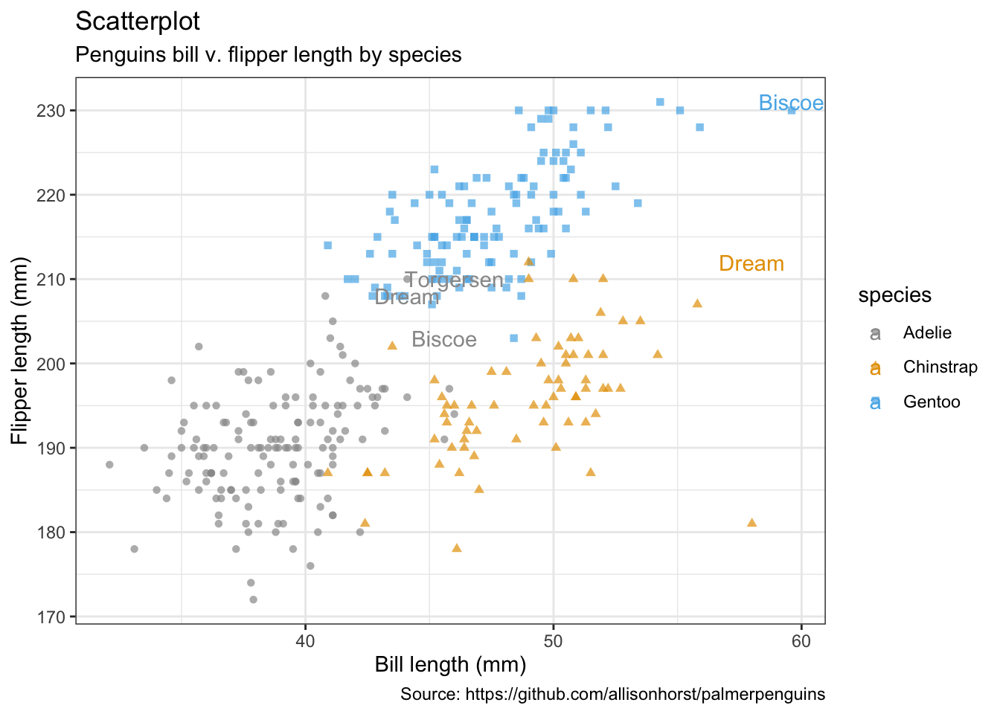

- Jitter with smoothing line


```r
penguins %>%
    remove_missing() %>%
    ggplot(aes(x = bill_length_mm, y = flipper_length_mm,
              color = species, shape = species)) +
    geom_jitter(alpha = 0.5) +
    geom_smooth(method = "loess", se = TRUE) +
    facet_wrap(vars(species), nrow = 3) +
    labs(x = "Bill length (mm)", 
         y = "Flipper length (mm)",
        title = "Scatterplot with smoothing line", 
        subtitle = "Penguins bill v. flipper length by species with loess smoothing line",
        caption = "Source: https://github.com/allisonhorst/palmerpenguins")
```

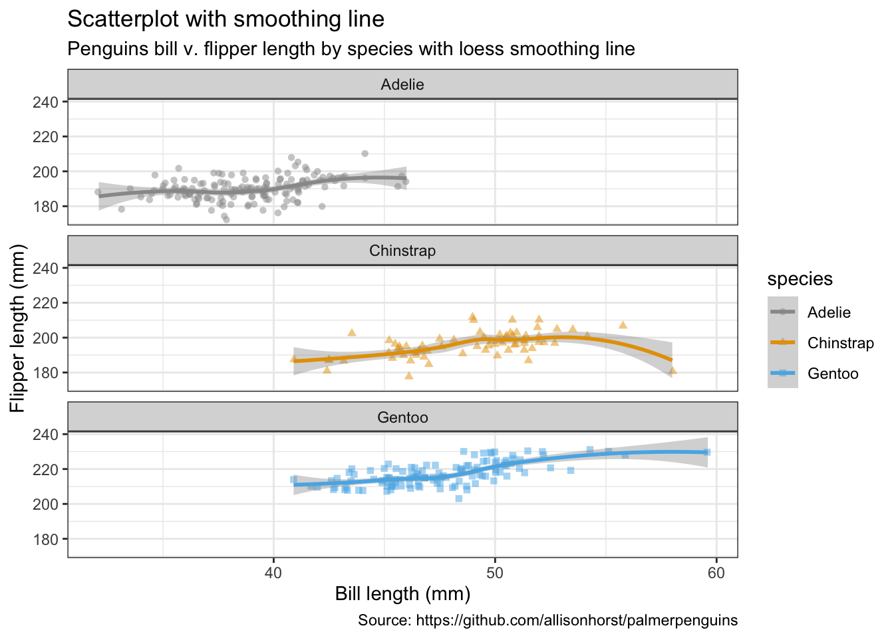


```r
penguins %>%
  remove_missing() %>%
  filter(species == "Adelie") %>%
  ggplot(aes(x = bill_length_mm, y = flipper_length_mm)) +
  geom_point(alpha = 0.5) +
  geom_smooth(method = "loess", se = TRUE) +
    labs(x = "Bill length (mm)", 
         y = "Flipper length (mm)",
        title = "Scatterplot with smoothing line", 
        subtitle = "Penguins bill v. flipper length by species with\nloess smoothing line, histogram & density distribution",
        caption = "Source: https://github.com/allisonhorst/palmerpenguins")
```

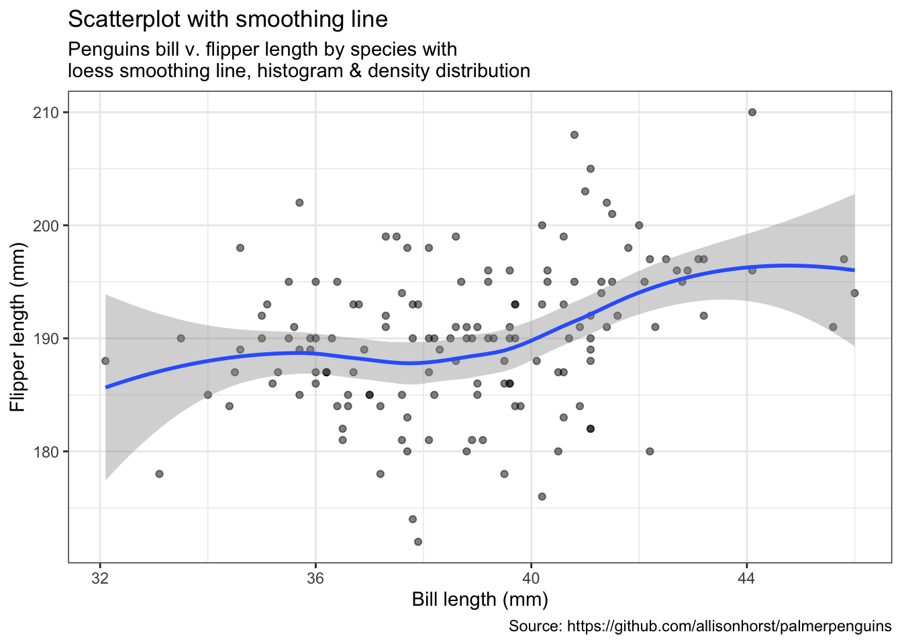

```r
#(ggMarginal(p, type = "densigram", fill = "transparent"))
```

## 气泡图


```r
penguins %>%
    remove_missing() %>%
    ggplot(aes(x = bill_length_mm, y = flipper_length_mm,
              color = species, shape = species, size = body_mass_g)) +
    geom_point(alpha = 0.5) +
    labs(x = "Bill length (mm)", 
         y = "Flipper length (mm)",
        title = "Bubble plot", 
        size = "body mass (g)",
        subtitle = "Penguins bill v. flipper length by species;\nsize indicates body mass in grams",
        caption = "Source: https://github.com/allisonhorst/palmerpenguins")
```


## 线性图


```r
penguins %>%
    remove_missing() %>%
    filter(species == "Adelie") %>%
    ggplot(aes(x = bill_length_mm, y = flipper_length_mm,
               color = sex)) +
    geom_line() +
    geom_point() +
    labs(x = "Bill length (mm)", 
         y = "Flipper length (mm)",
        title = "Line plot", 
        subtitle = "Penguins bill v. flipper length by species and sex",
        caption = "Source: https://github.com/allisonhorst/palmerpenguins")
```


## 相关系数图/热力图


```r
mat <- penguins %>%
  remove_missing() %>%
  select(bill_depth_mm, bill_length_mm, body_mass_g, flipper_length_mm)

str(mat)
```

```
## tibble [333 × 4] (S3: tbl_df/tbl/data.frame)
##  $ bill_depth_mm    : num [1:333] 18.7 17.4 18 19.3 20.6 17.8 19.6 17.6 21.2 21.1 ...
##  $ bill_length_mm   : num [1:333] 39.1 39.5 40.3 36.7 39.3 38.9 39.2 41.1 38.6 34.6 ...
##  $ body_mass_g      : int [1:333] 3750 3800 3250 3450 3650 3625 4675 3200 3800 4400 ...
##  $ flipper_length_mm: int [1:333] 181 186 195 193 190 181 195 182 191 198 ...
```

```r
cormat <- round(cor(mat), 2)
cormat[upper.tri(cormat)] <- NA

cormat <- cormat %>%
  as_data_frame() %>%
  mutate(x = colnames(mat)) %>%
  gather(key = "y", value = "value", bill_depth_mm:flipper_length_mm)

cormat %>%
    remove_missing() %>%
    arrange(x, y) %>%
    ggplot(aes(x = x, y = y, fill = value)) + 
    geom_tile() +
    scale_fill_gradient2(low = "blue", high = "red", mid = "white", 
     midpoint = 0, limit = c(-1,1), space = "Lab", 
     name = "Pearson\nCorrelation") +
    theme(axis.text.x = element_text(angle = 45, vjust = 1, hjust = 1)) +
    coord_fixed() +
      labs(x = "", 
           y = "",
          title = "Correlation heatmap", 
          subtitle = "Correlation btw. penguins' traits",
          caption = "Source: https://github.com/allisonhorst/palmerpenguins")
```


## 条形图

- per default: counts


```r
penguins %>%
    remove_missing() %>%
    ggplot(aes(x = species,
               fill = sex)) +
    geom_bar() +
      labs(x = "Species", 
           y = "Counts",
          title = "Barchart", 
          subtitle = "Counts of male & female penguins per species in study",
          caption = "Source: https://github.com/allisonhorst/palmerpenguins")
```

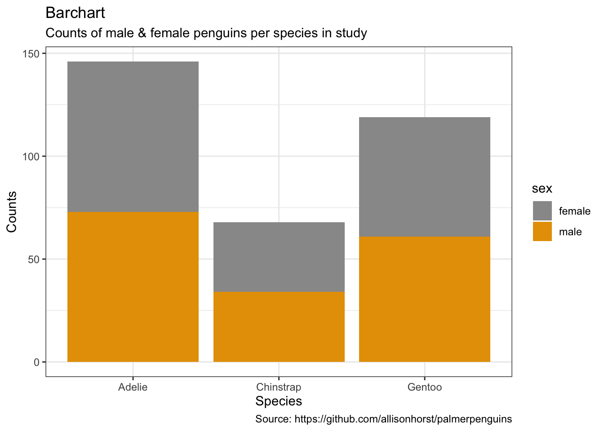


```r
penguins %>%
    remove_missing() %>%
    ggplot(aes(x = species,
               fill = sex)) +
    geom_bar(position = 'dodge') +
      labs(x = "Species", 
           y = "Counts",
          title = "Barchart", 
          subtitle = "Counts of male & female penguins per species in study",
          caption = "Source: https://github.com/allisonhorst/palmerpenguins")
```

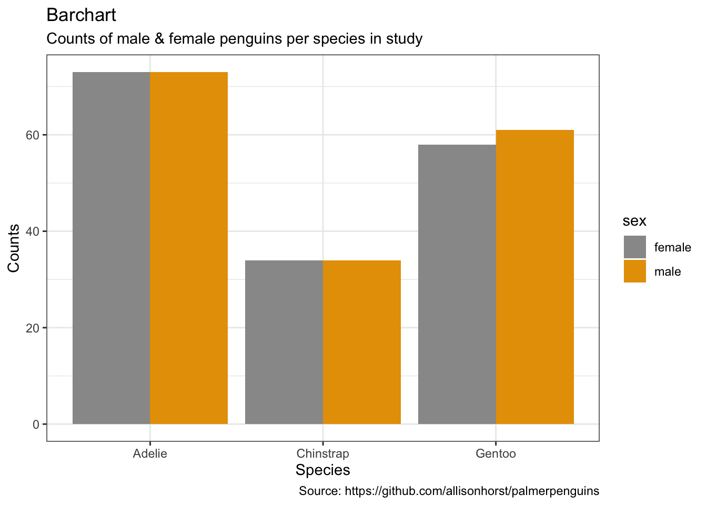

- alternative: set y-values


```r
penguins %>%
    remove_missing() %>%
    group_by(species, sex) %>%
    summarise(mean_bmg = mean(body_mass_g),
              sd_bmg = sd(body_mass_g)) %>%
    ggplot(aes(x = species, y = mean_bmg,
               fill = sex)) +
    geom_bar(stat = "identity", position = "dodge") +
    geom_errorbar(aes(ymin = mean_bmg - sd_bmg, 
                      ymax = mean_bmg + sd_bmg), 
                  width = 0.2,
                 position = position_dodge(0.9)) +
      labs(x = "Species", 
           y = "Mean body mass (in g)",
          title = "Barchart", 
          subtitle = "Mean body mass of male & female penguins per species\nwith standard deviation",
          caption = "Source: https://github.com/allisonhorst/palmerpenguins")
```

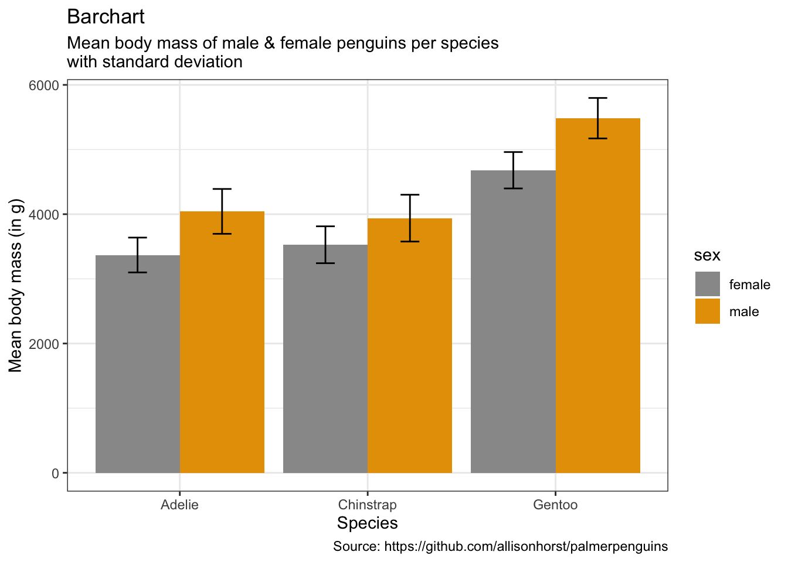


```r
library(plotly)

p <- penguins %>%
    remove_missing() %>%
    group_by(species, sex) %>%
    summarise(mean_bmg = mean(body_mass_g),
              sd_bmg = sd(body_mass_g)) %>%
    ggplot(aes(x = species, y = mean_bmg,
               fill = sex)) +
    geom_bar(stat = "identity", position = "dodge") +
    geom_errorbar(aes(ymin = mean_bmg - sd_bmg, 
                      ymax = mean_bmg + sd_bmg), 
                  width = 0.2,
                 position = position_dodge(0.9)) +
      labs(x = "Species", 
           y = "Mean body mass (in g)",
          title = "Barchart", 
          subtitle = "Mean body mass of male & female penguins per species\nwith standard deviation",
          caption = "Source: https://github.com/allisonhorst/palmerpenguins")

ggplotly(p)
```

```{=html}
<div id="htmlwidget-dbec7b6c18bbbf4bdd16" style="width:672px;height:480px;" class="plotly html-widget"></div>
<script type="application/json" data-for="htmlwidget-dbec7b6c18bbbf4bdd16">{"x":{"data":[{"orientation":"v","width":[0.45,0.45,0.45],"base":[0,0,0],"x":[0.775,1.775,2.775],"y":[3368.83561643836,3527.20588235294,4679.74137931035],"text":["species: Adelie<br />mean_bmg: 3368.836<br />sex: female","species: Chinstrap<br />mean_bmg: 3527.206<br />sex: female","species: Gentoo<br />mean_bmg: 4679.741<br />sex: female"],"type":"bar","textposition":"none","marker":{"autocolorscale":false,"color":"rgba(153,153,153,1)","line":{"width":1.88976377952756,"color":"transparent"}},"name":"(female,1)","legendgroup":"(female,1)","showlegend":true,"xaxis":"x","yaxis":"y","hoverinfo":"text","frame":null},{"orientation":"v","width":[0.45,0.45,0.45],"base":[0,0,0],"x":[1.225,2.225,3.225],"y":[4043.49315068493,3938.97058823529,5484.83606557377],"text":["species: Adelie<br />mean_bmg: 4043.493<br />sex: male","species: Chinstrap<br />mean_bmg: 3938.971<br />sex: male","species: Gentoo<br />mean_bmg: 5484.836<br />sex: male"],"type":"bar","textposition":"none","marker":{"autocolorscale":false,"color":"rgba(230,159,0,1)","line":{"width":1.88976377952756,"color":"transparent"}},"name":"(male,1)","legendgroup":"(male,1)","showlegend":true,"xaxis":"x","yaxis":"y","hoverinfo":"text","frame":null},{"x":[0.775,1.775,2.775],"y":[3368.83561643836,3527.20588235294,4679.74137931035],"text":["species: Adelie<br />mean_bmg: 3368.836<br />sex: female<br />mean_bmg - sd_bmg: 3099.456<br />mean_bmg + sd_bmg: 3638.216","species: Chinstrap<br />mean_bmg: 3527.206<br />sex: female<br />mean_bmg - sd_bmg: 3241.872<br />mean_bmg + sd_bmg: 3812.540","species: Gentoo<br />mean_bmg: 4679.741<br />sex: female<br />mean_bmg - sd_bmg: 4398.163<br />mean_bmg + sd_bmg: 4961.320"],"type":"scatter","mode":"lines","opacity":1,"line":{"color":"transparent"},"error_y":{"array":[269.380101843856,285.333911718307,281.578293642631],"arrayminus":[269.380101843856,285.333911718307,281.578293642631],"type":"data","width":5.25,"symmetric":false,"color":"rgba(0,0,0,1)"},"name":"(female,1)","legendgroup":"(female,1)","showlegend":false,"xaxis":"x","yaxis":"y","hoverinfo":"text","frame":null},{"x":[1.225,2.225,3.225],"y":[4043.49315068493,3938.97058823529,5484.83606557377],"text":["species: Adelie<br />mean_bmg: 4043.493<br />sex: male<br />mean_bmg - sd_bmg: 3696.682<br />mean_bmg + sd_bmg: 4390.305","species: Chinstrap<br />mean_bmg: 3938.971<br />sex: male<br />mean_bmg - sd_bmg: 3576.833<br />mean_bmg + sd_bmg: 4301.108","species: Gentoo<br />mean_bmg: 5484.836<br />sex: male<br />mean_bmg - sd_bmg: 5171.677<br />mean_bmg + sd_bmg: 5797.995"],"type":"scatter","mode":"lines","opacity":1,"line":{"color":"transparent"},"error_y":{"array":[346.811553187978,362.13755006812,313.158595620381],"arrayminus":[346.811553187978,362.137550068121,313.158595620381],"type":"data","width":5.25,"symmetric":false,"color":"rgba(0,0,0,1)"},"name":"(male,1)","legendgroup":"(male,1)","showlegend":false,"xaxis":"x","yaxis":"y","hoverinfo":"text","frame":null}],"layout":{"margin":{"t":43.7625570776256,"r":7.30593607305936,"b":40.1826484018265,"l":48.9497716894977},"plot_bgcolor":"rgba(255,255,255,1)","paper_bgcolor":"rgba(255,255,255,1)","font":{"color":"rgba(0,0,0,1)","family":"","size":14.6118721461187},"title":{"text":"Barchart","font":{"color":"rgba(0,0,0,1)","family":"","size":17.5342465753425},"x":0,"xref":"paper"},"xaxis":{"domain":[0,1],"automargin":true,"type":"linear","autorange":false,"range":[0.4,3.6],"tickmode":"array","ticktext":["Adelie","Chinstrap","Gentoo"],"tickvals":[1,2,3],"categoryorder":"array","categoryarray":["Adelie","Chinstrap","Gentoo"],"nticks":null,"ticks":"outside","tickcolor":"rgba(51,51,51,1)","ticklen":3.65296803652968,"tickwidth":0.66417600664176,"showticklabels":true,"tickfont":{"color":"rgba(77,77,77,1)","family":"","size":11.689497716895},"tickangle":-0,"showline":false,"linecolor":null,"linewidth":0,"showgrid":true,"gridcolor":"rgba(235,235,235,1)","gridwidth":0.66417600664176,"zeroline":false,"anchor":"y","title":{"text":"Species","font":{"color":"rgba(0,0,0,1)","family":"","size":14.6118721461187}},"hoverformat":".2f"},"yaxis":{"domain":[0,1],"automargin":true,"type":"linear","autorange":false,"range":[-289.899733059708,6087.89439425386],"tickmode":"array","ticktext":["0","2000","4000","6000"],"tickvals":[0,2000,4000,6000],"categoryorder":"array","categoryarray":["0","2000","4000","6000"],"nticks":null,"ticks":"outside","tickcolor":"rgba(51,51,51,1)","ticklen":3.65296803652968,"tickwidth":0.66417600664176,"showticklabels":true,"tickfont":{"color":"rgba(77,77,77,1)","family":"","size":11.689497716895},"tickangle":-0,"showline":false,"linecolor":null,"linewidth":0,"showgrid":true,"gridcolor":"rgba(235,235,235,1)","gridwidth":0.66417600664176,"zeroline":false,"anchor":"x","title":{"text":"Mean body mass (in g)","font":{"color":"rgba(0,0,0,1)","family":"","size":14.6118721461187}},"hoverformat":".2f"},"shapes":[{"type":"rect","fillcolor":"transparent","line":{"color":"rgba(51,51,51,1)","width":0.66417600664176,"linetype":"solid"},"yref":"paper","xref":"paper","x0":0,"x1":1,"y0":0,"y1":1}],"showlegend":true,"legend":{"bgcolor":"rgba(255,255,255,1)","bordercolor":"transparent","borderwidth":1.88976377952756,"font":{"color":"rgba(0,0,0,1)","family":"","size":11.689497716895},"title":{"text":"sex","font":{"color":"rgba(0,0,0,1)","family":"","size":14.6118721461187}}},"hovermode":"closest","barmode":"relative"},"config":{"doubleClick":"reset","modeBarButtonsToAdd":["hoverclosest","hovercompare"],"showSendToCloud":false},"source":"A","attrs":{"d6c386d842":{"x":{},"y":{},"fill":{},"type":"bar"},"d6c9dfd6dd":{"x":{},"y":{},"fill":{},"ymin":{},"ymax":{}}},"cur_data":"d6c386d842","visdat":{"d6c386d842":["function (y) ","x"],"d6c9dfd6dd":["function (y) ","x"]},"highlight":{"on":"plotly_click","persistent":false,"dynamic":false,"selectize":false,"opacityDim":0.2,"selected":{"opacity":1},"debounce":0},"shinyEvents":["plotly_hover","plotly_click","plotly_selected","plotly_relayout","plotly_brushed","plotly_brushing","plotly_clickannotation","plotly_doubleclick","plotly_deselect","plotly_afterplot","plotly_sunburstclick"],"base_url":"https://plot.ly"},"evals":[],"jsHooks":[]}</script>
```

## 箱线图


```r
pp <- penguins %>%
    remove_missing() %>%
    ggplot(aes(x = species, y = body_mass_g,
               fill = sex)) +
    geom_boxplot() +
      labs(x = "Species", 
           y = "Body mass (in g)",
          title = "Boxplot", 
          subtitle = "Body mass of three penguin species per sex",
          caption = "Source: https://github.com/allisonhorst/palmerpenguins")

ggplotly(pp)
```

```{=html}
<div id="htmlwidget-f1611d8806f0ffdb0ea3" style="width:672px;height:480px;" class="plotly html-widget"></div>
<script type="application/json" data-for="htmlwidget-f1611d8806f0ffdb0ea3">{"x":{"data":[{"x":[1,1,1,1,1,1,1,1,1,1,1,1,1,1,1,1,1,1,1,1,1,1,1,1,1,1,1,1,1,1,1,1,1,1,1,1,1,1,1,1,1,1,1,1,1,1,1,1,1,1,1,1,1,1,1,1,1,1,1,1,1,1,1,1,1,1,1,1,1,1,1,1,1,3,3,3,3,3,3,3,3,3,3,3,3,3,3,3,3,3,3,3,3,3,3,3,3,3,3,3,3,3,3,3,3,3,3,3,3,3,3,3,3,3,3,3,3,3,3,3,3,3,3,3,3,3,3,3,3,3,3,2,2,2,2,2,2,2,2,2,2,2,2,2,2,2,2,2,2,2,2,2,2,2,2,2,2,2,2,2,2,2,2,2,2],"y":[3250,3700,3550,3700,3500,3200,3700,3550,3800,2850,3450,2850,3450,3600,2900,3050,3800,3800,3350,3550,3150,3725,3450,3075,3550,3550,3400,3200,3300,3175,3600,3825,2900,3200,3300,3900,3325,2900,2925,3350,3350,3150,3150,3700,3100,3050,3000,3275,3500,3050,3600,3325,3625,3300,3200,3425,3450,3175,3450,3400,3325,3400,3400,3050,3800,3000,3500,3750,3475,3450,3150,3700,3250,4500,4300,4450,4150,4900,4550,4800,5100,4400,4850,4650,4400,4650,4900,4200,4300,4650,4450,4800,4200,4975,5000,4400,4700,5000,4575,4700,4600,4750,4750,4700,5050,4700,5150,4600,4950,4750,4350,4625,3950,4725,5000,4875,4625,4600,4200,4875,5200,4950,4850,4750,4375,4850,4400,4850,4700,4925,5200,3500,3650,3700,3525,3675,3950,3250,3600,4150,3675,3800,3300,3700,3400,3575,3350,3250,3700,3450,3525,3400,3650,2900,3850,3325,2700,3600,3775,3350,3200,3900,3650,3400,3500],"hoverinfo":"y","type":"box","fillcolor":"rgba(153,153,153,1)","marker":{"opacity":null,"outliercolor":"rgba(0,0,0,1)","line":{"width":1.88976377952756,"color":"rgba(0,0,0,1)"},"size":5.66929133858268},"line":{"color":"rgba(51,51,51,1)","width":1.88976377952756},"name":"(female,1)","legendgroup":"(female,1)","showlegend":true,"xaxis":"x","yaxis":"y","frame":null},{"x":[1,1,1,1,1,1,1,1,1,1,1,1,1,1,1,1,1,1,1,1,1,1,1,1,1,1,1,1,1,1,1,1,1,1,1,1,1,1,1,1,1,1,1,1,1,1,1,1,1,1,1,1,1,1,1,1,1,1,1,1,1,1,1,1,1,1,1,1,1,1,1,1,1,3,3,3,3,3,3,3,3,3,3,3,3,3,3,3,3,3,3,3,3,3,3,3,3,3,3,3,3,3,3,3,3,3,3,3,3,3,3,3,3,3,3,3,3,3,3,3,3,3,3,3,3,3,3,3,3,3,3,3,3,3,2,2,2,2,2,2,2,2,2,2,2,2,2,2,2,2,2,2,2,2,2,2,2,2,2,2,2,2,2,2,2,2,2,2],"y":[3750,3425,3950,4150,3650,4300,4675,4050,3800,4400,4450,3800,4500,3750,4200,4400,3600,4050,3950,3800,4250,3550,4700,3900,3950,3900,3900,4150,3900,4250,4150,3950,4300,4000,4650,4100,3700,4200,4400,3550,4600,4300,4725,4000,4250,3900,3950,4450,4475,3500,4775,4350,4600,4100,4275,3500,4075,3650,3725,4300,3325,3975,3900,3800,3875,3475,4000,4000,3775,3550,3900,4250,3750,5550,5850,5700,6300,5700,5200,5550,5100,5150,5700,5550,5250,5650,5050,5350,5800,5100,5650,5250,5700,5350,5450,5700,5350,4750,5600,5400,6050,5400,5550,5300,5400,5300,5650,5000,5200,4925,5850,5000,5250,5300,5600,5300,5500,5500,5050,5500,5800,5500,5550,5950,5000,5500,5550,5850,6000,5400,6000,5750,5950,5400,4550,3750,3650,3775,3600,4300,3950,4050,3550,4050,3725,4450,4100,4300,3250,3800,4800,4150,4500,4050,3900,3450,3300,4050,3800,4400,3950,3400,3700,4000,3950,3775,4100,3800],"hoverinfo":"y","type":"box","fillcolor":"rgba(230,159,0,1)","marker":{"opacity":null,"outliercolor":"rgba(0,0,0,1)","line":{"width":1.88976377952756,"color":"rgba(0,0,0,1)"},"size":5.66929133858268},"line":{"color":"rgba(51,51,51,1)","width":1.88976377952756},"name":"(male,1)","legendgroup":"(male,1)","showlegend":true,"xaxis":"x","yaxis":"y","frame":null}],"layout":{"margin":{"t":43.7625570776256,"r":7.30593607305936,"b":40.1826484018265,"l":48.9497716894977},"plot_bgcolor":"rgba(255,255,255,1)","paper_bgcolor":"rgba(255,255,255,1)","font":{"color":"rgba(0,0,0,1)","family":"","size":14.6118721461187},"title":{"text":"Boxplot","font":{"color":"rgba(0,0,0,1)","family":"","size":17.5342465753425},"x":0,"xref":"paper"},"xaxis":{"domain":[0,1],"automargin":true,"type":"linear","autorange":false,"range":[0.4,3.6],"tickmode":"array","ticktext":["Adelie","Chinstrap","Gentoo"],"tickvals":[1,2,3],"categoryorder":"array","categoryarray":["Adelie","Chinstrap","Gentoo"],"nticks":null,"ticks":"outside","tickcolor":"rgba(51,51,51,1)","ticklen":3.65296803652968,"tickwidth":0.66417600664176,"showticklabels":true,"tickfont":{"color":"rgba(77,77,77,1)","family":"","size":11.689497716895},"tickangle":-0,"showline":false,"linecolor":null,"linewidth":0,"showgrid":true,"gridcolor":"rgba(235,235,235,1)","gridwidth":0.66417600664176,"zeroline":false,"anchor":"y","title":{"text":"Species","font":{"color":"rgba(0,0,0,1)","family":"","size":14.6118721461187}},"hoverformat":".2f"},"yaxis":{"domain":[0,1],"automargin":true,"type":"linear","autorange":false,"range":[2520,6480],"tickmode":"array","ticktext":["3000","4000","5000","6000"],"tickvals":[3000,4000,5000,6000],"categoryorder":"array","categoryarray":["3000","4000","5000","6000"],"nticks":null,"ticks":"outside","tickcolor":"rgba(51,51,51,1)","ticklen":3.65296803652968,"tickwidth":0.66417600664176,"showticklabels":true,"tickfont":{"color":"rgba(77,77,77,1)","family":"","size":11.689497716895},"tickangle":-0,"showline":false,"linecolor":null,"linewidth":0,"showgrid":true,"gridcolor":"rgba(235,235,235,1)","gridwidth":0.66417600664176,"zeroline":false,"anchor":"x","title":{"text":"Body mass (in g)","font":{"color":"rgba(0,0,0,1)","family":"","size":14.6118721461187}},"hoverformat":".2f"},"shapes":[{"type":"rect","fillcolor":"transparent","line":{"color":"rgba(51,51,51,1)","width":0.66417600664176,"linetype":"solid"},"yref":"paper","xref":"paper","x0":0,"x1":1,"y0":0,"y1":1}],"showlegend":true,"legend":{"bgcolor":"rgba(255,255,255,1)","bordercolor":"transparent","borderwidth":1.88976377952756,"font":{"color":"rgba(0,0,0,1)","family":"","size":11.689497716895},"title":{"text":"sex","font":{"color":"rgba(0,0,0,1)","family":"","size":14.6118721461187}}},"hovermode":"closest","barmode":"relative"},"config":{"doubleClick":"reset","modeBarButtonsToAdd":["hoverclosest","hovercompare"],"showSendToCloud":false},"source":"A","attrs":{"d6c1d940114":{"x":{},"y":{},"fill":{},"type":"box"}},"cur_data":"d6c1d940114","visdat":{"d6c1d940114":["function (y) ","x"]},"highlight":{"on":"plotly_click","persistent":false,"dynamic":false,"selectize":false,"opacityDim":0.2,"selected":{"opacity":1},"debounce":0},"shinyEvents":["plotly_hover","plotly_click","plotly_selected","plotly_relayout","plotly_brushed","plotly_brushing","plotly_clickannotation","plotly_doubleclick","plotly_deselect","plotly_afterplot","plotly_sunburstclick"],"base_url":"https://plot.ly"},"evals":[],"jsHooks":[]}</script>
```

- with points


```r
penguins %>%
    remove_missing() %>%
    ggplot(aes(x = species, y = body_mass_g,
               fill = sex, color = sex)) +
    geom_boxplot(alpha = 0.5, notch = TRUE) +
    geom_jitter(alpha = 0.5, position=position_jitter(0.3)) +
      labs(x = "Species", 
           y = "Body mass (in g)",
          title = "Boxplot with points (dotplot)", 
          subtitle = "Body mass of three penguin species per sex",
          caption = "Source: https://github.com/allisonhorst/palmerpenguins")
```


## 小提琴图


```r
penguins %>%
    remove_missing() %>%
    ggplot(aes(x = species, y = body_mass_g,
               fill = sex)) +
    geom_violin(scale = "area") +
      labs(x = "Species", 
           y = "Body mass (in g)",
          title = "Violinplot", 
          subtitle = "Body mass of three penguin species per sex",
          caption = "Source: https://github.com/allisonhorst/palmerpenguins")
```

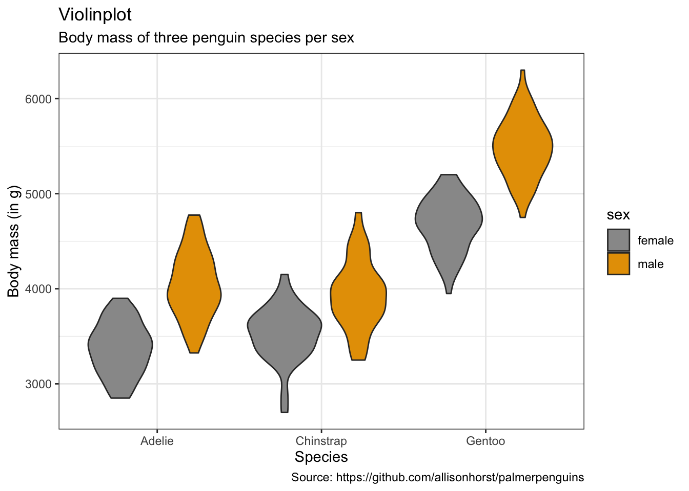

- with dots (sina-plots)


```r
penguins %>%
    remove_missing() %>%
    ggplot(aes(x = species, y = body_mass_g,
               fill = sex, color = sex)) +
    geom_dotplot(method = "dotdensity", alpha = 0.7,
                 binaxis = 'y', stackdir = 'center',
                 position = position_dodge(1)) +
      labs(x = "Species", 
           y = "Body mass (in g)",
          title = "Violinplot with points (dotplot)", 
          subtitle = "Body mass of three penguin species per sex",
          caption = "Source: https://github.com/allisonhorst/palmerpenguins")
```


## 饼图


```r
penguins %>%
    remove_missing() %>%
    group_by(species, sex) %>%
    summarise(n = n()) %>%
    mutate(freq = n / sum(n),
           percentage = freq * 100) %>%
    ggplot(aes(x = "", y = percentage,
               fill = sex)) +
    facet_wrap(vars(species), nrow = 1) +
    geom_bar(stat = "identity", alpha = 0.8) +
    coord_polar("y", start = 0) +
      labs(x = "", 
           y = "Percentage",
          title = "Piechart", 
          subtitle = "Percentage of male v. female penguins per species in study",
          caption = "Source: https://github.com/allisonhorst/palmerpenguins")
```


## 冲积图


```r
as.data.frame(UCBAdmissions) %>%
    ggplot(aes(y = Freq, axis1 = Gender, axis2 = Dept)) +
    geom_alluvium(aes(fill = Admit), width = 1/12) +
    geom_stratum(width = 1/12, fill = "black", color = "grey") +
    geom_label(stat = "stratum", aes(label = after_stat(stratum))) +
    scale_x_discrete(limits = c("Gender", "Dept"), expand = c(.05, .05)) +
      labs(x = "", 
           y = "Frequency",
          title = "Alluvial chart", 
          subtitle = "UC Berkeley admissions and rejections, by sex and department",
          caption = "Source: Bickel et al. (1975)\nSex bias in graduate admissions: Data from Berkeley. Science, 187, 398–403.")
```

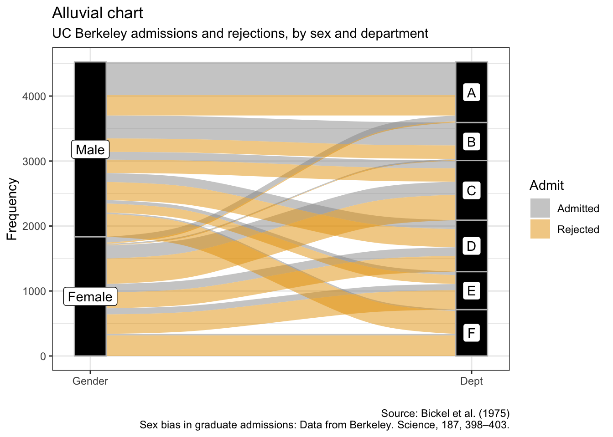

## 系谱图


```r
as.data.frame(UCBAdmissions) %>%
    group_by(Admit, Gender) %>%
    summarise(sum_freq = sum(Freq)) %>%
    ggplot(aes(area = sum_freq, fill = sum_freq, label = Gender, 
               subgroup = Admit)) +
    geom_treemap() +
    geom_treemap_subgroup_border() +
    geom_treemap_subgroup_text(place = "centre", grow = T, alpha = 0.5, colour =
                             "black", fontface = "italic", min.size = 0) +
    geom_treemap_text(colour = "white", place = "centre", reflow = T) +
    scale_fill_gradient2(low = "#999999", high = "#E69F00", mid = "white", midpoint = 1000, space = "Lab", 
     name = "Sum of\nfrequencies") +
      labs(x = "", 
           y = "",
          title = "Treemap", 
          subtitle = "UC Berkeley admissions and rejections by sex",
          caption = "Source: Bickel et al. (1975)\nSex bias in graduate admissions: Data from Berkeley. Science, 187, 398–403.")
```


## 哑铃图


```r
penguins %>%
    remove_missing() %>%
    group_by(year, species, sex) %>%
    summarise(mean_bmg = mean(body_mass_g)) %>%
    mutate(species_sex = paste(species, sex, sep = "_"),
         year = paste0("year_", year)) %>%
    spread(year, mean_bmg) %>%
    ggplot(aes(x = year_2007, xend = year_2009, 
               y = reorder(species_sex, year_2009))) +
    geom_dumbbell(color = "#999999", 
                      size_x = 3, 
                      size_xend = 3,
                      #Note: there is no US:'color' for UK:'colour' 
                      # in geom_dumbbel unlike standard geoms in ggplot()
                      colour_x = "#999999",
                      colour_xend = "#E69F00") +
      labs(x = "Body mass (g)", 
           y = "Species & sex",
          title = "Dumbbell plot", 
          subtitle = "Penguin's change in body mass from 2007 to 2009",
          caption = "Source: https://github.com/allisonhorst/palmerpenguins")
```


## 斜率图


```r
penguins %>%
    remove_missing() %>%
    group_by(year, species, sex) %>%
    summarise(mean_bmg = mean(body_mass_g)) %>%
    ggplot(aes(x = year, y = mean_bmg, group = sex,
               color = sex)) +
    facet_wrap(vars(species), nrow = 3) +
    geom_line(alpha = 0.6, size = 2) +
    geom_point(alpha = 1, size = 3) +
    scale_x_continuous(breaks=c(2007, 2008, 2009)) +
      labs(x = "Year", 
           y = "Body mass (g)",
           color = "Sex",
          title = "Slope chart", 
          subtitle = "Penguin's change in body mass from 2007 to 2009",
          caption = "Source: https://github.com/allisonhorst/palmerpenguins")
```

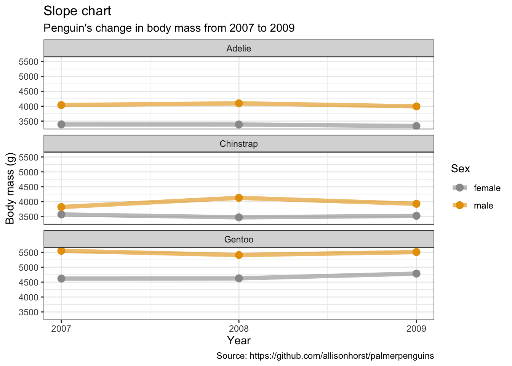

## 堆叠面积图


```r
penguins %>%
    remove_missing() %>%
    group_by(year, species, sex) %>%
    summarise(mean_bmg = mean(body_mass_g)) %>%
    ggplot(aes(x = year, y = mean_bmg, fill = sex)) +
    facet_wrap(vars(species), nrow = 3) +
    geom_area(alpha = 0.6, size=.5, color = "white") +
    scale_x_continuous(breaks=c(2007, 2008, 2009)) +
      labs(x = "Year", 
           y = "Mean body mass (g)",
           color = "Sex",
          title = "Stacked area chart", 
          subtitle = "Penguin's change in body mass from 2007 to 2009",
          caption = "Source: https://github.com/allisonhorst/palmerpenguins")
```

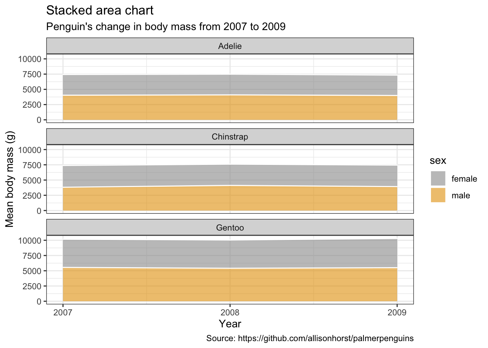

## 棒棒糖图


```r
penguins %>%
    remove_missing() %>%
    group_by(year, species, sex) %>%
    summarise(mean_bmg = mean(body_mass_g)) %>%
    mutate(species_sex = paste(species, sex, sep = "_"),
         year = paste0("year_", year)) %>%
    spread(year, mean_bmg) %>%
    ggplot() +
    geom_segment(aes(x = reorder(species_sex, -year_2009), xend = reorder(species_sex, -year_2009), 
                   y = 0, yend = year_2009),
                 color = "#999999", size = 1) +
    geom_point(aes(x = reorder(species_sex, -year_2009), y = year_2009),
               size = 4, color = "#E69F00") +
    coord_flip() +
      labs(x = "Species & sex", 
           y = "Body mass (g)",
          title = "Lollipop chart", 
          subtitle = "Penguin's body mass in 2009",
          caption = "Source: https://github.com/allisonhorst/palmerpenguins")
```


## 树状图


```r
library(ggdendro)
library(dendextend)
```


```r
penguins_hist <- penguins %>%
  filter(sex == "male") %>%
  select(species, bill_length_mm, bill_depth_mm, flipper_length_mm, body_mass_g) %>%
  group_by(species) %>% 
  sample_n(10) %>%
  as.data.frame()
rownames(penguins_hist) <- paste(penguins_hist$species, seq_len(nrow(penguins_hist)), sep = "_")

penguins_hist <- penguins_hist %>%
  select(-species) %>%
  remove_missing()
```


```r
hc <- hclust(dist(penguins_hist, method = "euclidean"), method = "ward.D2")
ggdendrogram(hc)
```


```r
# Create a dendrogram and plot it
penguins_hist %>%  
  scale %>% 
  dist(method = "euclidean") %>%
  hclust(method = "ward.D2") %>% 
  as.dendrogram() %>%
  plot()
```

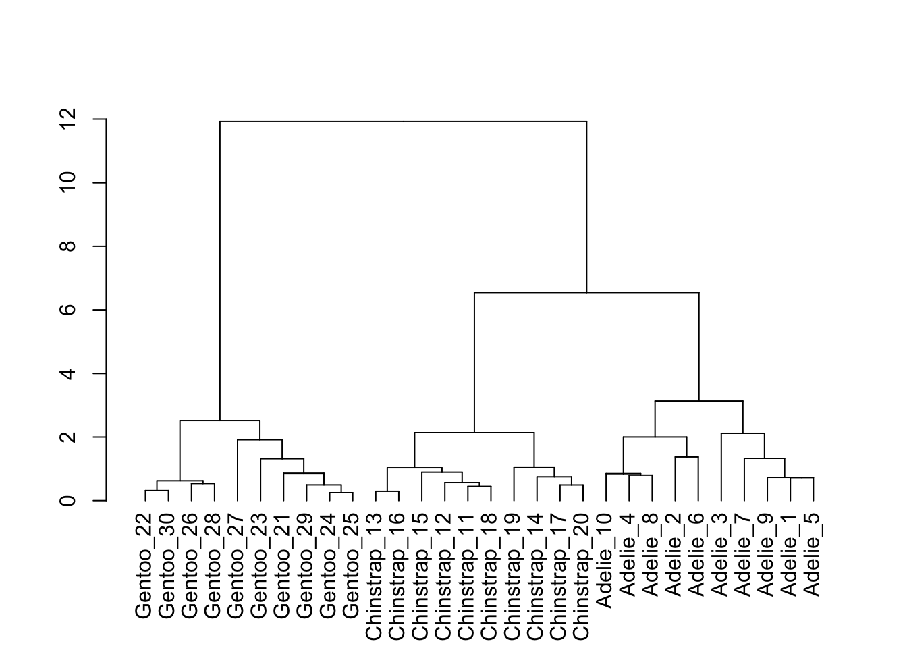

## 瀑布图


```r
library(waterfall)
```


```r
jaquith %>%
    arrange(score) %>%
    add_row(factor = "Total", score = sum(jaquith$score)) %>%
    mutate(factor = factor(factor, levels = factor),
                           id = seq_along(score)) %>%
    mutate(end = cumsum(score),
           start = c(0, end[-length(end)]),
           start = c(start[-length(start)], 0),
           end = c(end[-length(end)], score[length(score)]),
           gr_col = ifelse(factor == "Total", "Total", "Part")) %>%
    ggplot(aes(x = factor, fill = gr_col)) + 
      geom_rect(aes(x = factor,
                    xmin = id - 0.45, xmax = id + 0.45, 
                    ymin = end, ymax = start)) +
      theme(axis.text.x = element_text(angle = 60, vjust = 1, hjust = 1),
            legend.position = "none") +
        labs(x = "", 
             y = "Amount",
            title = "Waterfall chart", 
            subtitle = "Sample business-adjusted risk from Security Metrics",
            caption = "Andrew Jaquith, Security Metrics: Replacing Fear, Uncertainty, and Doubt\n(Boston: Addison-Wesley Professional, 2007), 170-171.")
```


## 双标图


```r
library(ggfortify)
```


```r
penguins_prep <- penguins %>%
  remove_missing() %>%
  select(bill_length_mm:body_mass_g)

penguins_pca <- penguins_prep %>%
  prcomp(scale. = TRUE)
```


```r
penguins_km <- penguins_prep %>%
  kmeans(3)
```


```r
autoplot(penguins_pca, 
                data = penguins %>% remove_missing(), 
                colour = 'species',
                shape = 'species',
                loadings = TRUE, 
                loadings.colour = 'blue',
                loadings.label = TRUE, 
                loadings.label.size = 3) +
      scale_color_manual(values = cbp1) +
  scale_fill_manual(values = cbp1) +
  theme_bw() +
            labs(
            title = "Biplot PCA", 
            caption = "Source: https://github.com/allisonhorst/palmerpenguins")
```

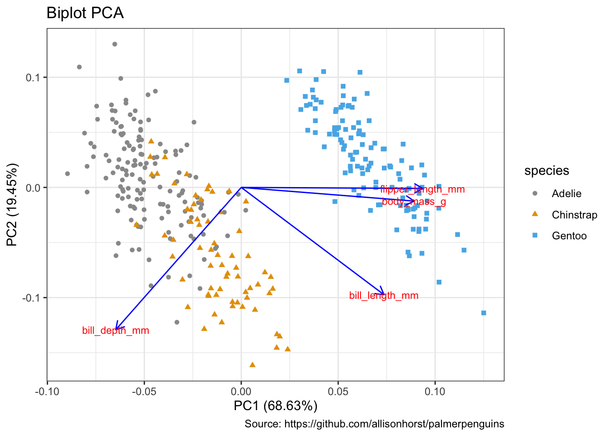


```r
autoplot(penguins_km, 
                data = penguins %>% remove_missing(), 
                colour = 'species',
                shape = 'species',
                frame = TRUE, frame.type = 'norm') +
      scale_color_manual(values = cbp1) +
  scale_fill_manual(values = cbp1) +
  theme_bw() +
            labs(
            title = "Biplot k-Means clustering", 
            caption = "Source: https://github.com/allisonhorst/palmerpenguins")
```


## 雷达图/星图/蜘蛛图

https://www.data-to-viz.com/caveat/spider.html


```r
library(ggiraphExtra)
```


```r
penguins %>%
    remove_missing() %>%
    select(-island, -year) %>%
    ggRadar(aes(x = c(bill_length_mm, bill_depth_mm, flipper_length_mm, body_mass_g), 
                group = species,
                colour = sex, facet = sex), 
            rescale = TRUE, 
            size = 1, interactive = FALSE, 
            use.label = TRUE) +
     scale_color_manual(values = cbp1) +
  scale_fill_manual(values = cbp1) +
  theme_bw() +
     scale_y_discrete(breaks = NULL) + # don't show ticks
      labs(
          title = "Radar/spider/star chart", 
          subtitle = "Body mass of male & female penguins per species",
          caption = "Source: https://github.com/allisonhorst/palmerpenguins")
```


