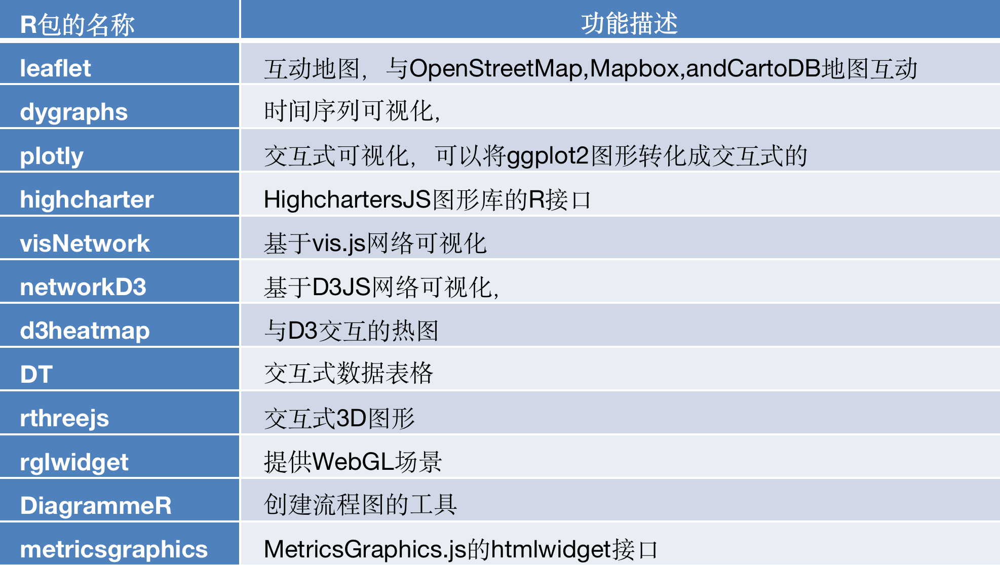

# 认识交互式绘图工具{#interactive-ploting}


前面可视化的结果就是一个静态的图形，所有信息都一目了然地放在一张图上。

静态图形适合于分析报告等纸质媒介，而在网络时代，如果在网页上发布可视化，那么动态的、交互的图形则更有优势。

在R的环境中，动态交互图形的优势在于能和knitr，shiny等框架整合在一起，能迅速建立一套可视化原型系统。

> 由于pdf不支持html有关的图形输出，这里只给代码，可以自行运行，查看结果。

> 注意：提前安装好相应的包。

htmlwidgets包，这是一个专为R语言打造的可视化JS库，只需要编写几行R语言代码便可生成交互式的可视化页面。目前已经有基于htmlwidgets制作的R包可供直接调用，具体名称及对应作用见表



## leaflet包


```r
library(leaflet)
leaflet() %>% addTiles() %>% addMarkers(lng = 174.768, lat = -36.852, popup = "ThebirthplaceofR")
```

## dygraphs包


```r
library(dygraphs)
lungDeaths <- cbind(mdeaths, fdeaths)
dygraph(lungDeaths)
```

## plotly包


```r
library(plotly)
pal <- RColorBrewer::brewer.pal(nlevels(iris$Species), "Set1")
plot_ly(data = iris, x = ~Sepal.Length, y = ~Petal.Length, color = ~Species, colors = pal, 
    mode = "markers")
```


```r
p <- ggplot(iris, aes(x = Sepal.Length, y = Petal.Length, colour = Species)) + scale_color_brewer(palette = "Set1") + 
    geom_point()
ggplotly(p)
```

## DT包


```r
library(DT)
datatable(iris)
```

## networkD3包


```r
library(networkD3)
src <- c("A", "A", "A", "A", "B", "B", "C", "C", "D")
target <- c("B", "C", "D", "J", "E", "F", "G", "H", "I")
networkData <- data.frame(src, target)
simpleNetwork(networkData, zoom = T)
```


```r
data(MisLinks)
data(MisNodes)
forceNetwork(Links = MisLinks, Nodes = MisNodes, Source = "source", Target = "target", 
    Value = "value", NodeID = "name", Group = "group", opacity = 0.8)
```

## 利用Shiny包实现可交互的Web应用

shiny的官网包含了非常多的内容，包括详细教程，案例等。网站地址如下：

<https://shiny.rstudio.com/tutorial/>
