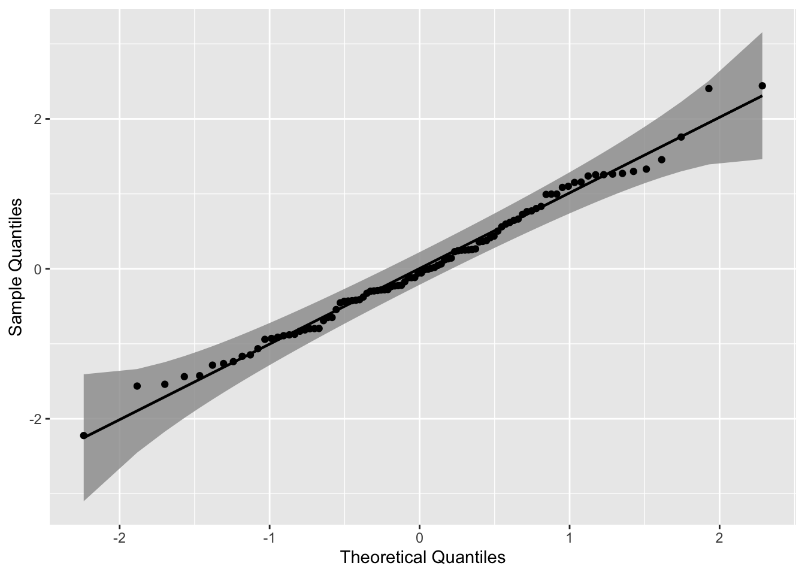
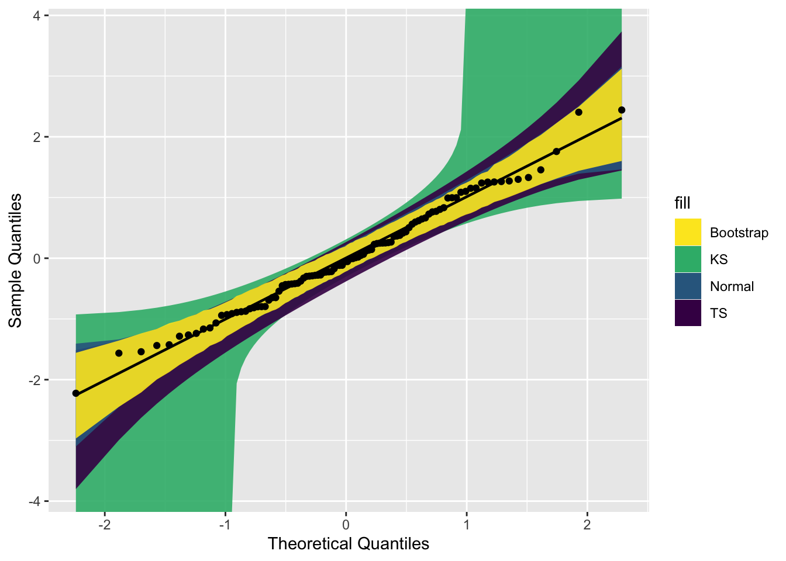
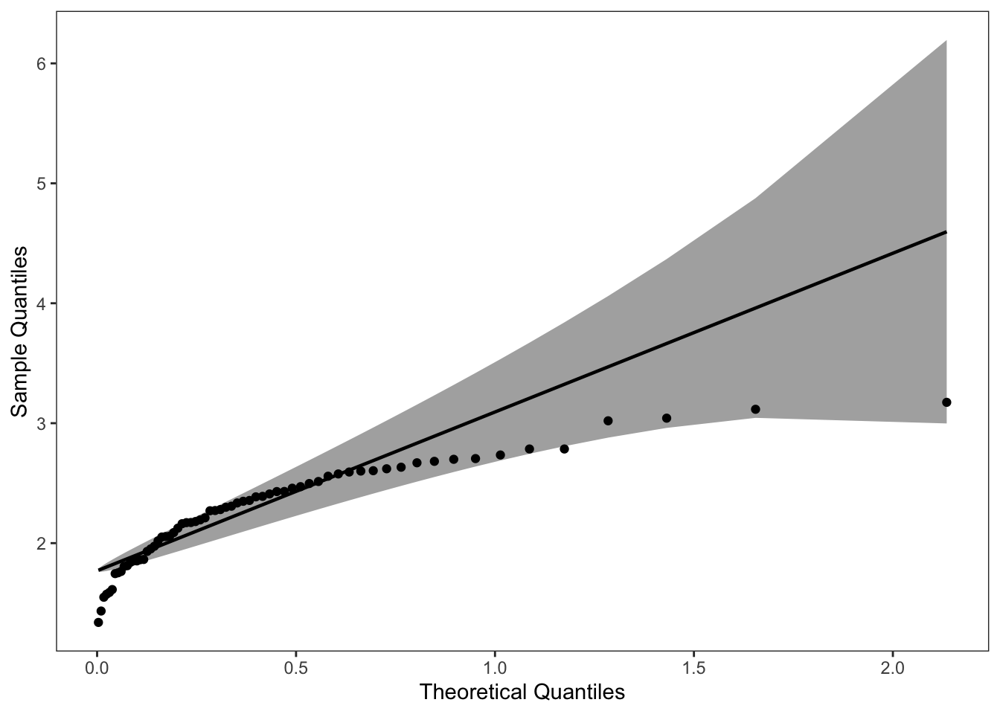
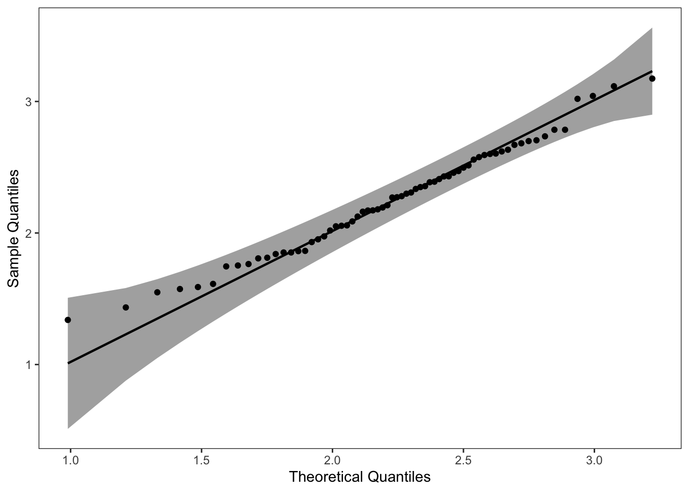
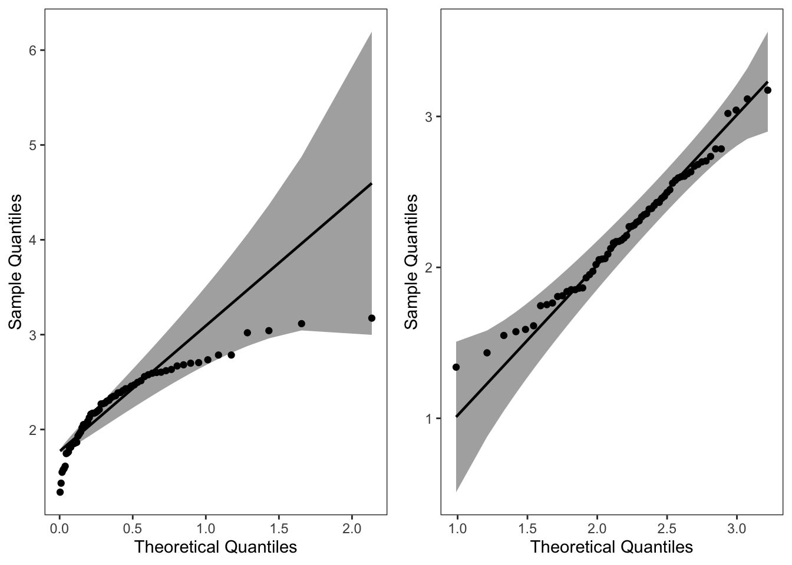
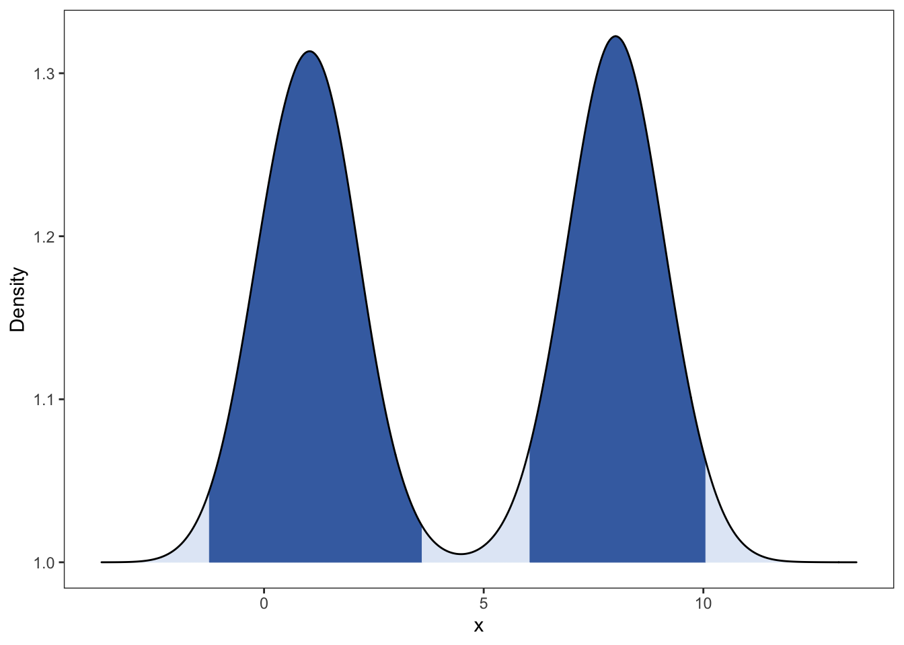
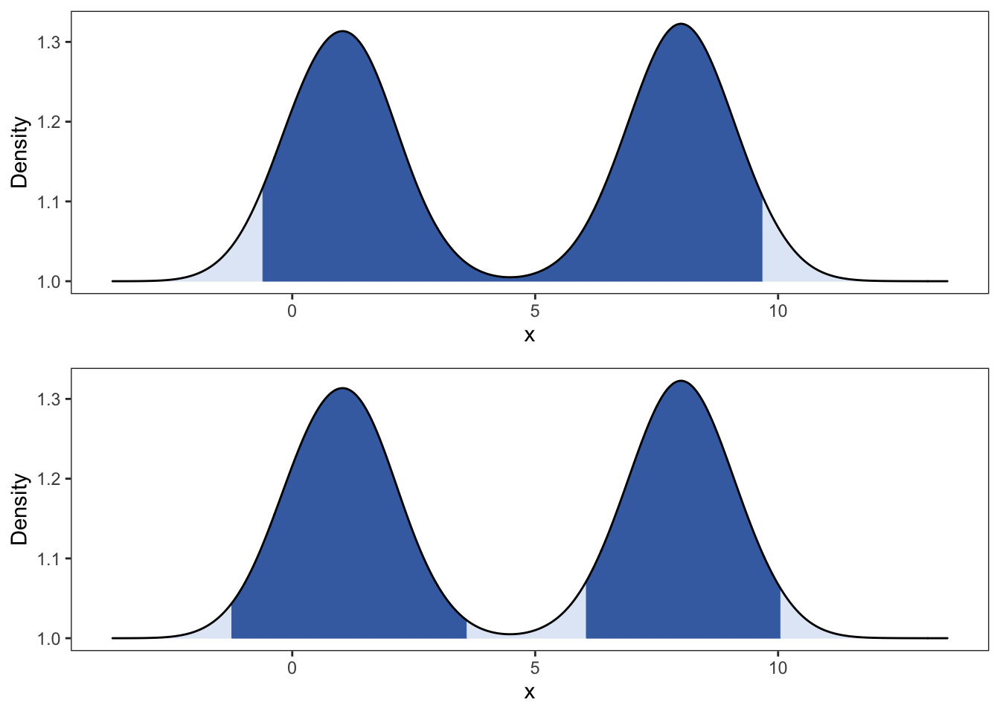

# 常用案例{#some-tips}


## 绘制不同分布的 QQ 图

这里主要是用 qqplotr 包进行绘制，参考的博客：[An Introduction to qqplotr](https://cran.r-project.org/web/packages/qqplotr/vignettes/introduction.html)。

### 简单版本

#### 绘制正态分布的 QQ 图


```r
library(qqplotr)
library(ggplot2)
# 随机产生数据
set.seed(0)
smp <- data.frame(norm = rnorm(100))
# 绘制
gg <- ggplot(data = smp, mapping = aes(sample = norm)) + stat_qq_band() + stat_qq_line() + 
    stat_qq_point() + labs(x = "Theoretical Quantiles", y = "Sample Quantiles")
gg
```




使用三种不同的置信带构造置信区间，其可以用参数 `bandType` 调整。

```r
library(viridis)
gg <- ggplot(data = smp, mapping = aes(sample = norm)) + geom_qq_band(bandType = "ks", 
    mapping = aes(fill = "KS"), alpha = 0.9) + geom_qq_band(bandType = "ts", mapping = aes(fill = "TS"), 
    alpha = 0.9) + geom_qq_band(bandType = "pointwise", mapping = aes(fill = "Normal"), 
    alpha = 0.9) + geom_qq_band(bandType = "boot", mapping = aes(fill = "Bootstrap"), 
    alpha = 0.9) + stat_qq_line() + stat_qq_point() + labs(x = "Theoretical Quantiles", 
    y = "Sample Quantiles") + scale_fill_viridis(discrete = T, direction = -1)

gg
```




### 进阶版本

读者绘制正态分布的 QQ 图，还是比较简单。但是如果是其他分布的情况呢？

> 这里以一个可靠性数据为例子，该数据来源于文献：Badar, M. G., Priest, A. M. (1982). Statistical aspects of fiber and bundle strength in hybrid composites. In: Hayashi, T., Kawata, K., Umekawa, S., eds. Progress in Science and Engineering Composites. Tokyo: ICCM-IV, pp. 1129–1136。


```r
data = data.frame(y = c(1.339, 1.434, 1.549, 1.574, 1.589, 1.613, 1.746, 1.753, 1.764, 
    1.807, 1.812, 1.84, 1.852, 1.852, 1.862, 1.864, 1.931, 1.952, 1.974, 2.019, 2.051, 
    2.055, 2.058, 2.088, 2.125, 2.162, 2.171, 2.172, 2.18, 2.194, 2.211, 2.27, 2.272, 
    2.28, 2.299, 2.308, 2.335, 2.349, 2.356, 2.386, 2.39, 2.41, 2.43, 2.431, 2.458, 
    2.471, 2.497, 2.514, 2.558, 2.577, 2.593, 2.601, 2.604, 2.62, 2.633, 2.67, 2.682, 
    2.699, 2.705, 2.735, 2.785, 2.785, 3.02, 3.042, 3.116, 3.174))
```

#### 绘制指数分布的 QQ 图

这里我们绘制其指数分布的 QQ 图。根据指数函数参数拟合该数据之后，得到`rate =2.2867`，并将其保存到 list 中。

> 具体如何拟合，读者自行搜索 R 包中的相关函数。

其他代码基本不变，主要是将 `stat_qq_line()` 和 `stat_qq_point()` 中的分布设定下，参数设定下。


```r
# exponential distribution
dp <- list(rate = 2.2867)
di <- "exp"
p1 = ggplot(data = data, mapping = aes(sample = y)) + stat_qq_band(distribution = di, 
    dparams = dp) + stat_qq_line(distribution = di, dparams = dp) + stat_qq_point(distribution = di, 
    dparams = dp) + labs(x = "Theoretical Quantiles", y = "Sample Quantiles") + theme_bw() + 
    theme(panel.grid = element_blank())
p1
```




#### 绘制威布尔分布的 QQ 图

同理，将该数据应用到威布尔分布中。结果如下：


```r
# weibull distribution
di <- "weibull"  # exponential distribution
dp <- list(shape = 5.4766, scale = 2.4113)
p2 = ggplot(data = data, mapping = aes(sample = y)) + stat_qq_band(distribution = di, 
    dparams = dp) + stat_qq_line(distribution = di, dparams = dp) + stat_qq_point(distribution = di, 
    dparams = dp) + labs(x = "Theoretical Quantiles", y = "Sample Quantiles") + theme_bw() + 
    theme(panel.grid = element_blank())
p2
```



可以看到该数据集，更适合使用 weibull分布进行拟合。


```r
library(cowplot)
plot_grid(p1, p2, ncol = 2, nrow = 1)
```




## 绘制混合密度函数图以及添加分位数线

主要使用 `ggridges` 包中的 `stat_density_ridges()`。参考的博客：https://cran.r-project.org/web/packages/ggridges/vignettes/introduction.html


### 加载包

```r
library(ggplot2)
library(ggridges)
```

### 产生数据集

假设数据来源于一个混合分布。

```r
item <- 10000
inds <- rbinom(1, item, 0.5)
x <- c(rnorm(inds, 1, 1), rnorm(item - inds, 8, 1))
data <- data.frame(value = x, class = rep(1, length(x)))
```

### 绘制密度函数图并添加分位数线


```r
# 绘图
p1 <- ggplot(data, aes(x = value, y = class, fill = factor(stat(quantile)))) + stat_density_ridges(geom = "density_ridges_gradient", 
    calc_ecdf = TRUE, quantiles = c(0.025, 0.975)) + scale_fill_manual(name = "Probability", 
    values = c("#E2EAF6", "#436FB0", "#E2EAF6")) + theme_bw() + theme(legend.position = "none", 
    panel.grid = element_blank()) + labs(x = "x", y = "Density")
p1
```


```r
p2 <- ggplot(data, aes(x = value, y = class, fill = factor(stat(quantile)))) + stat_density_ridges(geom = "density_ridges_gradient", 
    calc_ecdf = TRUE, quantiles = c(0.005, 0.495, 0.51, 0.99)) + scale_fill_manual(name = "Probability", 
    values = c("#E2EAF6", "#436FB0", "#E2EAF6", "#436FB0", "#E2EAF6"), ) + theme_bw() + 
    theme(legend.position = "none", panel.grid = element_blank()) + labs(x = "x", 
    y = "Density")

p2
```




### 合并两图（使用cowplot包）

```r
library(cowplot)
# pdf('plot_cow.pdf', width = 8, height = 4)
plot_grid(p1, p2, ncol = 1, nrow = 2)
```



```r
# dev.off()
```


