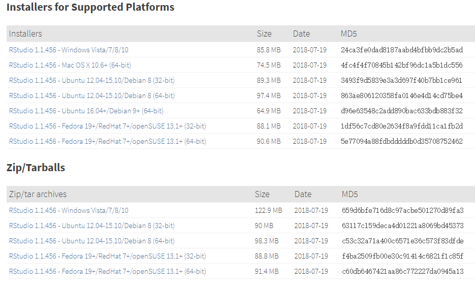

# 附录{#appendix}

为了方便初学者快速入门以及文稿的完整性，这里罗列了常用问题的介绍，包括：安装R和Rstudio，使用Rstudio可能遇到的问题以及如何获取帮助。

**注：**该部分来源于[《数据科学中的 R 语言》](https://bookdown.org/wangminjie/R4DS/intro-R.html#%E5%A6%82%E4%BD%95%E8%8E%B7%E5%8F%96%E5%B8%AE%E5%8A%A9)。


## 安装R和Rstudio{-}

R软件是一个自由、开源软件平台，具有统计分析、可视化和编程的强大功能。你可以从这里免费下载。为了更好的使用 R 软件，我推荐大家使用RStudio这个IDE。这里有个在线教程帮助我们熟悉 R 和 RStudio。

### 安装 R{-}

我们从官方网站http://cran.r-project.org下载, 网站界面感觉有点朴素:


### 安装RStudio{-}

安装完R， 还需要安装RStudio。有同学可能要问 R 与 RStudio 是什么关系呢？打个比方吧，R 就像汽车的发动机, RStudio 就是汽车的仪表盘。但我更觉得 R 是有趣的灵魂，而 Rstudio 是好看的皮囊。


同样，我们从官方网站下载并安装，如果你是苹果系统的用户，选择苹果系统对应的rstudio版本即可。

- https://www.rstudio.com/download
- 选择RStudio Desktop




## 可能的问题{-}

- 问题1：如果下载速度太慢，可以选择国内镜像，


然后再输入命令`install.packages("tidyverse")`，或者直接指定清华大学镜像


```
install.packages("tidyverse", repos = "http://mirrors.tuna.tsinghua.edu.cn/CRAN")
```

- 问题2：如果遇到如下报错信息


```
Warning in install.packages :
  unable to access index for repository http://cran.rstudio.com/src/contrib:
  cannot open URL 'http://cran.rstudio.com/src/contrib/PACKAGES'
```

输入下面命令后，再试试


```
options(download.file.method="libcurl")
```

或者打开`D:\R\etc\Rprofile.site`，添加以下内容：


```
local({r <- getOption("repos")
       r["CRAN"] <- "http://mirrors.tuna.tsinghua.edu.cn/CRAN"
       options(repos=r)})

options(download.file.method="libcurl")
```

- 问题3：如果打开代码是乱码，可以试试修改如下设置


- 问题4：如果每次打开Rstudio非常慢，可以在Rstudio里将这几个选项取消


- 问题5：如果 Rstudio 打开是空白

很大的可能是你的电脑用户名是中文的，修改用户名再试试

- 问题6：安装过程中提示，我的系统不能兼容 64 位的 Rstudio。

可能你是低版本的windows系统，建议安装旧版本的Rstudio，可以在[这里](https://rstudio.com/products/rstudio/older-versions/)找到旧版本.

更多Rstudio的使用，可参考这里[introducing-the-rstudio](https://www.pipinghotdata.com/posts/2020-09-07-introducing-the-rstudio-ide-and-r-markdown/)。

##  如何获取帮助{-}

- 记住和学习所有的函数几乎是不可能的
- 打开函数的帮助页面(`Rstudio`右下面板的`Help`选项卡)


```
?sqrt
?gather
?spread
?ggplot2
?scale
?map_dfr
```

比如：


## R 语言社区{-}

R 语言社区非常友好，可以在这里找到你问题的答案

- twitter: https://twitter.com/
- R-Bloggers: https://www.r-bloggers.com/
- kaggle: https://www.kaggle.com/
- stackoverflow: https://stackoverflow.com/questions/tagged/r
- rstudio: https://community.rstudio.com/


